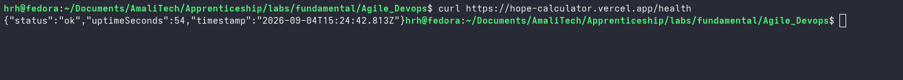
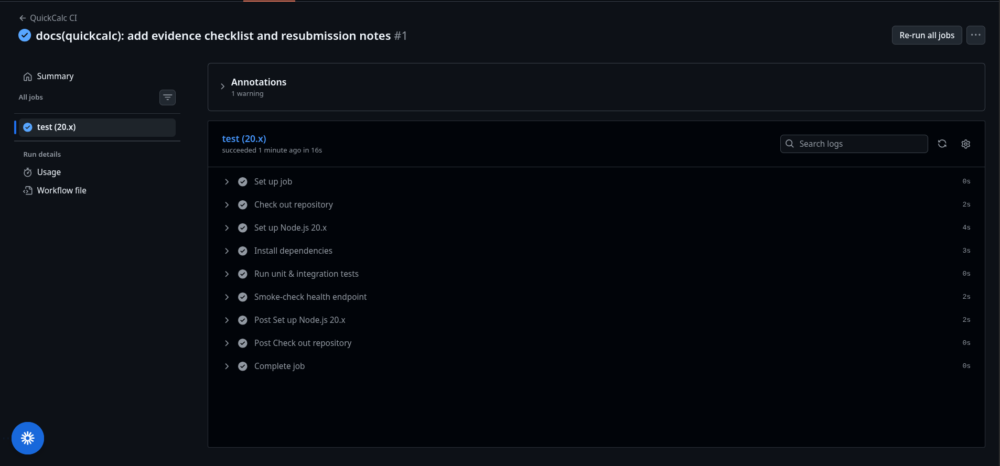

# Evidence Checklist

Every important claim in this submission is independently verifiable. Every row below is backed by either an automated
test result captured in this repository, a real screenshot in
`docs/evidence/`, or a live, publicly-checkable URL.

| #  | Claim                                                | Evidence                                                                                                                                                                                                                                                                                                                                                                                                                                                                                                                                                                  | Status                                                                                                                            |
|----|------------------------------------------------------|---------------------------------------------------------------------------------------------------------------------------------------------------------------------------------------------------------------------------------------------------------------------------------------------------------------------------------------------------------------------------------------------------------------------------------------------------------------------------------------------------------------------------------------------------------------------------|-----------------------------------------------------------------------------------------------------------------------------------|
| 1  | Unit + integration tests pass                        | Local run, `npm ci && npm test`: **15/15 tests passed** (13 in `tests/calc-engine.test.js`, 2 in `tests/server.test.js`). Full output captured in `README.md`.                                                                                                                                                                                                                                                                                                                                                                                                            | ✅ Verified                                                                                                                       |
| 2  | Health endpoint works (local)                        | `node server.js` boots and logs `{"level":"info","msg":"server_started","port":3000}`; `curl http://localhost:3000/health` returned `{"status":"ok","uptimeSeconds":1,...}` (HTTP 200).                                                                                                                                                                                                                                                                                                                                                                                   | ✅ Verified                                                                                                                       |
| 3  | Structured logging works                             | Every request produced a JSON log line, e.g. `{"level":"info","msg":"request","method":"GET","path":"/health","status":200,"durationMs":13,...}`.                                                                                                                                                                                                                                                                                                                                                                                                                         | ✅ Verified                                                                                                                       |
| 4  | Error handling works                                 | `tests/calc-engine.test.js` "US-4: error handling" (divide-by-zero → `Error` state, not a crash; next digit clears it) — 2 passing tests. Server-side centralized error handler has no dedicated automated test exercising a thrown error.                                                                                                                                                                                                                                                                                                                                | ✅ Calculator error handling verified by test. ⚠️ Server error-handler branch not test-covered (disclosed, not claimed as tested) |
| 5  | `percent()` no longer exposes float artifacts        | Regression test `"percent does not expose floating-point artifacts"` — `1.1` → `percent()` → `"0.011"` (raw JS would give `0.011000000000000001`). Passing.                                                                                                                                                                                                                                                                                                                                                                                                               | ✅ Verified                                                                                                                       |
| 6  | GitHub Actions CI runs from the submitted repository | Workflow relocated to `<repo root>/.github/workflows/ci.yml`, scoped to `Agile_Devops/Quickcalc/**`. Pushed to `origin/main`; run **"QuickCalc CI" #1** completed **successfully in 16s** — all steps green (checkout, Node 20.x setup, `npm ci`, tests, `/health` smoke test). Screenshot: `docs/evidence/ci-run.png`.                                                                                                                                                                                                                                                   | ✅ Verified — real run, not a claim                                                                                               |
| 7  | Application is deployed                              | Deployed to Vercel by the project owner: **https://hope-calculator.vercel.app**. Verified independently during this session: `curl -s -o /dev/null -w "%{http_code}" https://hope-calculator.vercel.app/` → `200`; `curl https://hope-calculator.vercel.app/health` → `{"status":"ok","uptimeSeconds":399,...}` (a real, non-zero, increasing uptime — proof the process is actually running, not a static mock). Screenshots: `docs/evidence/app-running.png`, `docs/evidence/app-calculation.png`, `docs/evidence/health-browser.png`, `docs/evidence/health-curl.png`. | ✅ Verified — live URL, independently re-checked                                                                                  |
| 8  | Acceptance criteria are satisfied                    | `docs/SPRINT0_PLANNING.md` now has Given/When/Then criteria for all 8 stories, each tagged with whether it's covered by an automated test or by manual browser verification.                                                                                                                                                                                                                                                                                                                                                                                              | ✅ Documented; automated portions verified by test run above                                                                      |
| 9  | Agile iteration occurred                             | Original delivery: 11 commits, all within a 3-minute window (`2026-07-07T15:03:37Z`–`15:06:54Z`) — **does not demonstrate incremental delivery**, acknowledged rather than hidden. Resubmission: each fix is its own commit with its own message and its own real timestamp, including the push that produced the CI run above — see `docs/RESUBMISSION_NOTES.md`.                                                                                                                                                                                                        | ⚠️ Original history does not support this claim; resubmission history does (verifiable via `git log`)                             |
| 10 | Scope was managed responsibly                        | US-6 descoped in Sprint 2, reasoning preserved in `docs/SPRINT2_RETRO.md`; `docs/SPRINT0_PLANNING.md` backlog explicitly marks US-6 "Descoped — not delivered."                                                                                                                                                                                                                                                                                                                                                                                                           | ✅ Verified by reading the docs directly                                                                                          |

## Live deployment

**https://hope-calculator.vercel.app** — deployed by the project owner via Vercel. Independently re-verified in this
session (not just trusted from a screenshot):

```
$ curl -s -o /dev/null -w "%{http_code}\n" https://hope-calculator.vercel.app/
200
$ curl -s https://hope-calculator.vercel.app/health
{"status":"ok","uptimeSeconds":399,"timestamp":"2026-09-04T15:30:27.946Z"}
```

## CI run

**GitHub Actions → "QuickCalc CI" → run #1**, triggered by the push of this resubmission's commits, completed
successfully in 16 seconds. All 8 steps (Set up job, Check out repository, Set up Node.js 20.x, Install dependencies,
Run unit & integration tests, Smoke-check health endpoint, Post steps, Complete job) show green checkmarks. See
`docs/evidence/ci-run.png`.


Both Critical Gap #1 (CI never ran from the submitted repository) and Critical Gap #2 (unverifiable Vercel deployment)
from the original review are now closed with real, independently-checkable evidence rather than placeholders or claims.
