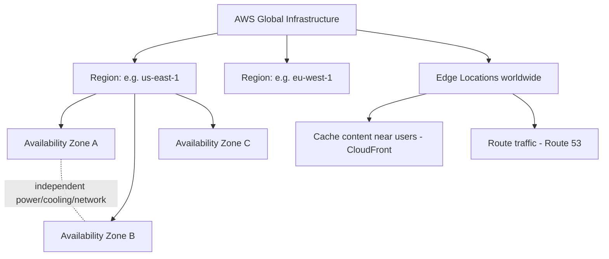
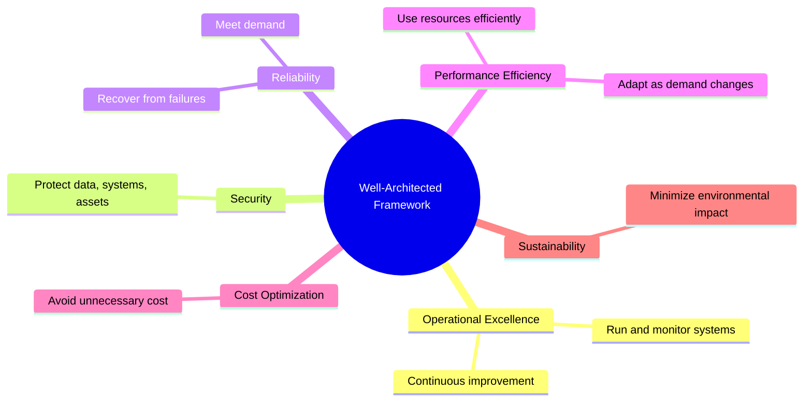
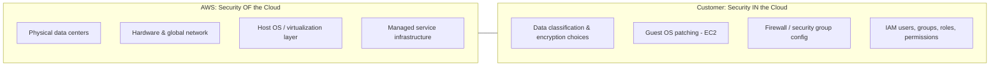
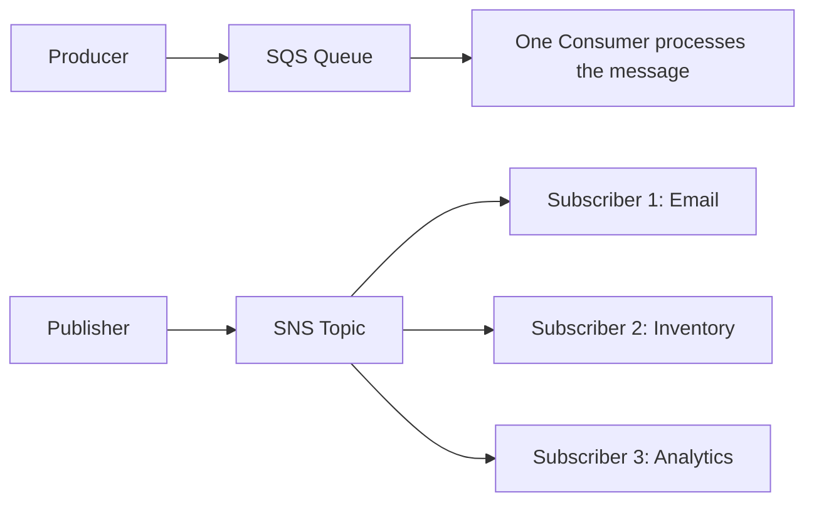
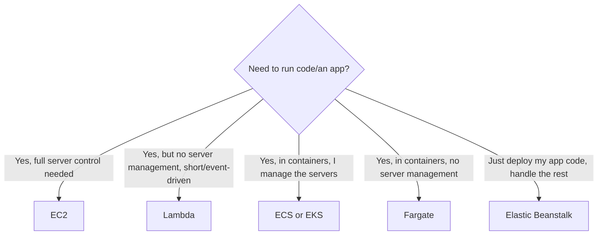
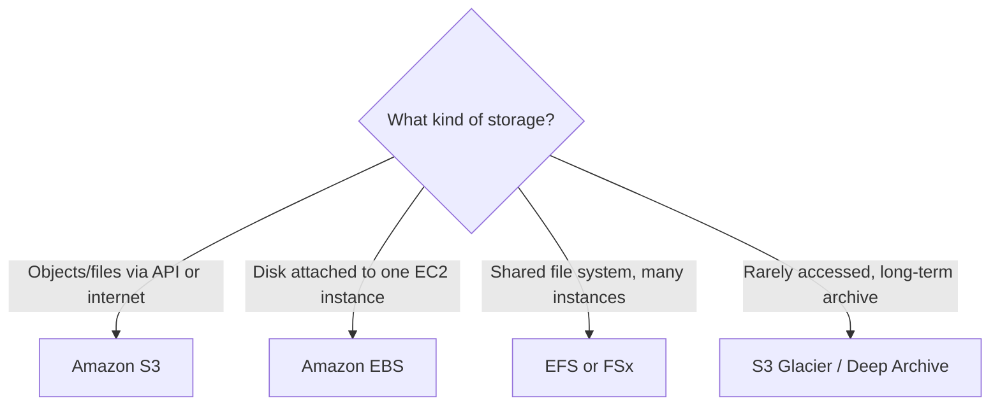

# AWS Certified Cloud Practitioner CLF-C02
## 7-Hour Complete Exam Preparation Course

---

## Course Overview

This course is a self-contained preparation program for the **AWS Certified Cloud Practitioner (CLF-C02)** exam. It is built around the current official exam guide, not a generic AWS introduction.

It is designed for approximately **7 hours of focused study**, split across four exam domains plus orientation, strategy, and review. Every lesson follows the same loop: concept, reasoning, comparison, scenario, trap, recall, practice. You should be able to study this document alone and be exam-ready — outside links are optional reinforcement, never a requirement.

**What this course does:**
- Teaches AWS services by the *problem they solve*, not alphabetically or by feature list.
- Compares services that the exam commonly uses as distractors.
- Trains the reasoning process used to answer scenario questions.
- Ends with a 50-question mock exam with full explanations.

**What this course does not do:**
- Teach you to administer, configure, or architect AWS in depth.
- Cover every feature of every service.
- Treat CLF-C02 as a technical deep-dive — it is a foundational, business-and-concepts exam with light technical recognition.

---

## Exam Overview

| Item | Detail |
|---|---|
| Exam code | CLF-C02 |
| Format | Multiple choice (1 correct answer) and multiple response (2+ correct answers) |
| Questions | 65 total (50 scored, 15 unscored — you won't know which is which) |
| Time | 90 minutes |
| Passing score | 700 / 1000 (scaled score, not a raw percentage) |
| Delivery | Pearson VUE — testing center or online proctored |

### Domain weighting

| Domain | Weight | Focus |
|---|---:|---|
| 1. Cloud Concepts | 24% | Value proposition, economics, global infrastructure, Well-Architected |
| 2. Security and Compliance | 30% | Shared responsibility, IAM, data protection, compliance, governance |
| 3. Cloud Technology and Services | 34% | Compute, storage, databases, networking, integration, analytics, AI/ML |
| 4. Billing, Pricing, and Support | 12% | Pricing models, cost tools, support plans, account structure |

Domains 2 and 3 together are **64%** of the exam — this course allocates study time accordingly.

### How the exam tests you

CLF-C02 rarely asks "what does X stand for." It asks: *given this business scenario, which AWS concept or service fits?* Your job is pattern recognition — matching a described need to the right service family — not memorizing configuration steps.

---

## How to Use This Course

Pick the path that matches how you learn. All three use the same underlying content.

### Documentation Learner
For each lesson, work through in order:
1. What You Need to Know
2. Mental Model
3. Service Comparison table
4. Real-World Scenario
5. Active Recall (attempt before reading the answers)
6. Mini Practice questions

### Video Learner
For each section:
1. Watch the **Recommended Video Learning Path** entry for that section first.
2. Read the condensed "What You Need to Know" text to fill any gaps.
3. Complete Active Recall.
4. Complete Mini Practice.

Video is reinforcement here, not a dependency — every concept is fully explained in text.

### Hands-On Learner
For each topic marked with a **Practical Exercise**:
1. Read the concept section first.
2. Do the exercise in the AWS Free Tier console (5–15 minutes).
3. Explain out loud or in writing what you just did and why.
4. Complete the scenario questions for that topic.

---

## Course Map

| Part | Topic | Time | Exam Domain |
|---|---|---:|---|
| 0 | Exam Orientation | 15 min | All |
| 1 | Cloud Concepts | 60 min | Domain 1 |
| 2 | Security & Compliance | 90 min | Domain 2 |
| 3 | Cloud Technology & Services | 150 min | Domain 3 |
| 4 | Billing, Pricing & Support | 45 min | Domain 4 |
| 5 | Exam Reasoning & Question Strategy | 30 min | All |
| 6 | Final Review + Mock Assessment | 50 min | All |
| — | **Total** | **~7 hours** | |

Each lesson displays:
**Estimated time · Exam domain · What you will learn · What you should be able to answer afterward.**

---

## Practical Exercises Index

All hands-on exercises in this course in one place, so a hands-on learner can jump straight to them (each also appears inline in its lesson, in context). Total hands-on time: about **50 minutes**, all doable in the AWS Free Tier console.

| # | Exercise | Location | Time | Objective |
|---|---|---|---|---|
| 1 | Draw the shared-responsibility line | Lesson 2.1 | 5 min | Recall AWS vs. customer responsibilities without looking |
| 2 | Explore IAM | Lesson 2.2 | 12 min | Locate root user, create a user/group, view a policy, enable MFA |
| 3 | Explore CloudTrail | Lesson 2.6 | 5 min | View Event History and identify the last 5 API calls |
| 4 | Explore EC2 | Lesson 3.1 | 10 min | Identify Instance, AMI, Instance Type, Security Group, Key Pair, Region/AZ |
| 5 | Explore S3 | Lesson 3.2 | 10 min | Create a bucket, upload an object, review storage classes and permissions |
| 6 | Explore CloudWatch | Lesson 3.5 | 10 min | Find an EC2 metric, view a log group, create an alarm |
| 7 | Explore Billing tools | Lesson 4.2 | 10 min | Open Budgets, Cost Explorer, and the Pricing Calculator and identify what each shows |

**How to use this index:** if you're a hands-on learner, do each exercise the moment you reach its lesson — don't batch them at the end. Immediately after each one, say out loud (or write) what you just did and why it matters for the exam, then answer that lesson's scenario questions.

---

# Part 0 — Exam Orientation

**Estimated time:** 15 minutes
**Exam domain:** All
**What you will learn:** How CLF-C02 is structured, scored, and what "foundational" actually means for this exam.
**What you should be able to answer afterward:** What kinds of questions to expect, and how to pace the 90 minutes.

## 0.1 Who this exam is for

CLF-C02 validates that you understand the AWS Cloud value proposition, can describe key services and use cases, understand basic security and shared responsibility, and know how billing, pricing, and support work. It is not a hands-on or architecture exam.

## 0.2 Question types you'll see

| Type | Description | Strategy |
|---|---|---|
| Multiple choice | One correct answer among 4 options | Eliminate obviously wrong answers first |
| Multiple response | Exactly 2+ correct answers stated in the prompt (e.g., "choose TWO") | Evaluate each option independently — don't stop at one correct answer |

## 0.3 Time budget

65 questions in 90 minutes ≈ 80 seconds per question. Flag anything taking longer than ~90 seconds and return to it at the end — don't let one hard question eat your buffer.

## 0.4 What "foundational" means in practice

If a question requires you to know a CLI flag, a config file syntax, or a specific API parameter — that's not CLF-C02. If it asks "a company needs X, which service fits," that is squarely in scope. Keep this filter running as you study: depth is capped deliberately.

## 0.5 Orientation checklist

- [ ] I know the four domains and their approximate weights.
- [ ] I know the exam is 65 questions, 90 minutes, scored 100-1000, passing 700.
- [ ] I understand multiple-response questions require selecting all correct options.
- [ ] I understand this exam tests recognition and reasoning, not configuration.

# Part 1 — Cloud Concepts

**Estimated time:** 60 minutes
**Exam domain:** Domain 1 (24%)

## 1.1 Cloud Computing and the AWS Value Proposition

**Estimated time:** 12 min · **Domain:** 1
**What you will learn:** What cloud computing means and why AWS's value proposition is tested repeatedly through different wording.
**What you should be able to answer afterward:** Which benefit (agility, elasticity, cost, global reach) a scenario is describing.

### What You Need to Know
Cloud computing is the on-demand delivery of IT resources over the internet with pay-as-you-go pricing, instead of buying and running your own data centers. AWS's value proposition is usually tested as one of six benefits:

| Benefit | Meaning |
|---|---|
| Trade capital expense for variable expense | Pay for compute/storage as you use it, instead of buying servers up front |
| Benefit from massive economies of scale | AWS's scale lowers per-unit costs, passed to customers |
| Stop guessing capacity | Scale up or down based on actual demand |
| Increase speed and agility | Provision resources in minutes, not weeks |
| Stop spending money running and maintaining data centers | Focus on the business, not racking servers |
| Go global in minutes | Deploy in multiple AWS Regions worldwide quickly |

### Why It Matters
Almost every "why would a company move to AWS" question maps to one of these six benefits. The exam tests whether you can match a business statement to the right benefit category.

### Mental Model
> Cloud = renting IT infrastructure instead of owning it, billed like a utility.

### Key AWS Terms
CapEx, OpEx, elasticity, scalability, agility, undifferentiated heavy lifting.

### Real-World Scenario
> A startup wants to launch a product without spending money on servers before knowing if it will succeed.
Reasoning: no upfront capital, pay only for what's used → **variable expense / low upfront cost** benefit.

### Exam Trap
"Elasticity" and "scalability" are often used interchangeably in casual speech but tested as related-not-identical: scalability is the *capability* to grow, elasticity is the *automatic* adjustment up and down with demand.

### Active Recall
1. What are the six pillars of the AWS value proposition?
2. What is "undifferentiated heavy lifting"?
3. How does "go global in minutes" differ from "economies of scale"?

#### Answers
1. Trade CapEx for OpEx, economies of scale, stop guessing capacity, speed and agility, stop maintaining data centers, go global in minutes.
2. Work that doesn't differentiate your business (power, racking, patching) but must still be done — AWS takes it over.
3. Going global is about geographic reach/deployment speed; economies of scale is about AWS's purchasing power reducing unit cost.

### Mini Practice
**Q1.** A company currently spends heavily on purchasing and maintaining physical servers years in advance of need. Which AWS benefit most directly addresses this?
A) Go global in minutes B) Trade capital expense for variable expense C) Economies of scale D) Increase speed and agility
**Answer:** B. *Why:* the problem described is upfront capital spending — the fix is paying only for what's consumed. A is about geography, C is about unit pricing not spending model, D is about deployment speed.

**Q2.** A retailer wants to serve customers in Europe and Asia with low latency within days, without building data centers there. Which benefit is this?
A) Economies of scale B) Go global in minutes C) Stop guessing capacity D) Variable expense
**Answer:** B. *Why:* rapid multi-region deployment is literally this benefit. The others don't address geography.

---

## 1.2 Cloud Economics

**Estimated time:** 10 min · **Domain:** 1

### What You Need to Know
- **CapEx (Capital Expenditure):** upfront spending on physical assets (servers, data centers), depreciated over years.
- **OpEx (Operational Expenditure):** ongoing spending for day-to-day operation, billed as consumed.
- **Economies of scale:** AWS buys and operates infrastructure at a scale no single customer could, lowering unit costs over time (prices have historically decreased repeatedly).
- **Variable/pay-as-you-go pricing:** you pay for compute-seconds, storage-GB, and data transferred, not fixed capacity.

### Why It Matters
Domain 1 and Domain 4 both touch pricing philosophy; Domain 1 tests the *concept*, Domain 4 tests the *tools*.

### Mental Model
> On-prem = buy the whole restaurant. Cloud = pay per meal.

### Service Comparison
| Model | Who bears the up-front cost | Flexibility |
|---|---|---|
| On-premises | You (CapEx) | Low — fixed capacity |
| AWS Cloud | AWS (OpEx for you) | High — scale in/out anytime |

### Real-World Scenario
> A finance team wants to convert unpredictable, lumpy IT spending into predictable operational spending tied to actual usage.
Reasoning: this describes the CapEx → OpEx shift, the foundational cloud economics benefit.

### Exam Trap
Don't confuse "economies of scale" (AWS's cost advantage passed to you) with "variable expense" (your billing model). They're related but tested as separate concepts.

### Active Recall
1. Define CapEx and OpEx in one sentence each.
2. Why do AWS prices tend to decrease over time?

#### Answers
1. CapEx = upfront investment in owned infrastructure. OpEx = ongoing operating cost billed as incurred.
2. AWS's massive scale lets it negotiate lower costs and pass savings to customers as usage grows.

### Mini Practice
**Q1.** Which pricing shift best represents moving IT spend from CapEx to OpEx?
A) Buying servers for 5 years upfront B) Paying monthly for only the compute hours used C) Signing a long-term data center lease D) Purchasing perpetual software licenses
**Answer:** B. *Why:* pay-for-what-you-use is OpEx; the others are upfront capital commitments.

---

## 1.3 AWS Global Infrastructure

**Estimated time:** 12 min · **Domain:** 1
**Practical Exercise:** Open the [AWS Global Infrastructure Regional Products & Services page](https://aws.amazon.com/about-aws/global-infrastructure/regional-product-services/) and identify how many Availability Zones exist in a Region near you. (5 min)

### What You Need to Know
| Term | Definition |
|---|---|
| Region | A physical geographic location containing multiple, isolated Availability Zones (e.g., us-east-1) |
| Availability Zone (AZ) | One or more discrete data centers with independent power, cooling, and networking, within a Region |
| Edge Location | A CloudFront/Route 53 endpoint used to cache content and route traffic closer to users |
| Local Zone | An extension of a Region placed closer to large population/industry centers for low-latency needs |

### Why It Matters
Regions and AZs are the backbone of AWS's high-availability story: place resources across multiple AZs and a single data center failure doesn't take down your application.

### Mental Model
> Region = country. Availability Zone = a city within it, isolated from the others. Edge Location = a local delivery office near the customer.

*Each Region contains multiple isolated Availability Zones; Edge Locations are a separate, much larger network of caching/routing points spread globally, independent of any single Region.*

### Service Comparison
| Need | Use |
|---|---|
| Data residency / lowest latency to a specific market | Choose the nearest Region |
| Resilience against one data center failing | Deploy across multiple AZs in a Region |
| Fast content delivery to end users worldwide | CloudFront Edge Locations |

### Real-World Scenario
> An application must survive the complete loss of one data center without downtime.
Reasoning: deploy across ≥2 Availability Zones within a Region — this is precisely what AZs are for.

### Exam Trap
A Region is not the same as an Availability Zone, and neither is the same as an Edge Location. Watch for questions that swap these terms as distractors ("deploy in multiple regions" vs. "multiple AZs" for HA within one geography — the AZ answer is usually correct for regional HA).

### Active Recall
1. What is the difference between a Region and an Availability Zone?
2. What problem do Edge Locations solve?
3. Why does AWS isolate power and networking between AZs?

#### Answers
1. A Region is a geographic area containing multiple AZs; an AZ is one or more isolated data centers within that Region.
2. Reducing latency for end users by caching/serving content from a location physically closer to them.
3. So a failure in one AZ (power, cooling, network) doesn't cascade to others, enabling fault tolerance.

### Mini Practice
**Q1.** A company wants its application to remain available even if an entire data center in its Region goes offline. What should it do?
A) Deploy only in one Availability Zone B) Deploy across multiple Availability Zones C) Deploy only at Edge Locations D) Use a single EC2 instance
**Answer:** B. *Why:* multi-AZ deployment is the standard HA pattern. A and D are single points of failure; C addresses latency, not resilience.

**Q2. (Multiple response)** Which TWO statements are true about AWS Regions?
A) Every Region has exactly one Availability Zone B) Regions are isolated from one another C) Choosing a nearby Region can reduce latency D) Edge Locations replace the need for Regions E) A Region can span multiple countries
**Answer:** B, C. *Why:* Regions contain multiple AZs (not one), are independent of each other, and proximity reduces latency. D and E are false.

---

## 1.4 Elasticity, Scalability, High Availability, and Fault Tolerance

**Estimated time:** 10 min · **Domain:** 1

### What You Need to Know
| Term | Meaning |
|---|---|
| Scalability | The ability of a system to grow (or shrink) to handle load, manually or automatically |
| Elasticity | Automatic scaling up and down in response to real-time demand |
| High Availability (HA) | Designing so the system keeps running, with minimal downtime, through redundancy |
| Fault Tolerance | The system continues operating correctly even when a component fails, with no impact to the user |

### Why It Matters
These four words appear constantly as answer options and are subtly different — the exam expects you to pick the *most precise* one.

### Mental Model
> Scalable = can grow. Elastic = grows and shrinks automatically. Highly available = rarely goes down. Fault tolerant = never notices when a part fails.

### Service Comparison
| Requirement in the question | Best-fit term/pattern |
|---|---|
| "Automatically add/remove capacity based on traffic" | Elasticity (e.g., Auto Scaling) |
| "Application must handle 10x more users next year" | Scalability |
| "System should keep running through a component failure with zero user impact" | Fault tolerance |
| "System should stay up almost all the time" | High availability |

### Real-World Scenario
> An e-commerce site sees traffic spike 5x during a flash sale, then drop back to normal a few hours later.
Reasoning: automatic capacity adjustment up and down in real time = **elasticity**.

### Exam Trap
Fault tolerance is more absolute (zero impact) than high availability (minimal but possibly brief impact). If a question says "no disruption at all," lean fault tolerant; if it says "minimize downtime," lean HA.

### Active Recall
1. What's the difference between elasticity and scalability?
2. Give an example of fault tolerance.
3. Is "99.99% uptime" a description of HA or fault tolerance?

#### Answers
1. Scalability is the general capacity to grow; elasticity specifically means automatic, real-time up/down adjustment.
2. A multi-AZ database where a failover happens with no application-visible interruption.
3. High availability — it describes an uptime target, not a guarantee of zero disruption.

### Mini Practice
**Q1.** Which AWS capability best demonstrates elasticity?
A) Manually resizing an EC2 instance once a year B) Auto Scaling adding instances during a traffic spike and removing them afterward C) Choosing a larger instance type at launch D) Storing backups in S3 Glacier
**Answer:** B. *Why:* automatic, demand-driven scaling is the definition of elasticity.

---

## 1.5 AWS Well-Architected Framework

**Estimated time:** 10 min · **Domain:** 1

### What You Need to Know
The Well-Architected Framework provides a consistent way to evaluate architectures across six pillars:

| Pillar | Focus |
|---|---|
| Operational Excellence | Running and monitoring systems, continuous improvement |
| Security | Protecting data, systems, and assets |
| Reliability | Recovering from failures, meeting demand |
| Performance Efficiency | Using resources efficiently as demand changes |
| Cost Optimization | Avoiding unnecessary costs |
| Sustainability | Minimizing environmental impact |

### Why It Matters
The exam tests recognition of the six pillar names and matching a scenario to the right one — not deep architectural review.

### Mental Model
> Think of it as a six-point checklist for "is this architecture good?" — each pillar asks a different question.

### Real-World Scenario
> A company wants a framework to evaluate whether its workload minimizes unnecessary spend.
Reasoning: this maps directly to the **Cost Optimization** pillar.

### Exam Trap
"Reliability" and "Performance Efficiency" get confused: Reliability = recovers from failure and meets demand; Performance Efficiency = uses the *right* resources efficiently, adapting as demand and technology change.

### Active Recall
1. Name all six pillars.
2. Which pillar concerns minimizing environmental impact?
3. Which pillar is about protecting data and managing access?

#### Answers
1. Operational Excellence, Security, Reliability, Performance Efficiency, Cost Optimization, Sustainability.
2. Sustainability.
3. Security.

### Mini Practice
**Q1.** A team wants guidance on selecting the right instance types and storage to match workload demands over time. Which pillar addresses this?
A) Reliability B) Performance Efficiency C) Operational Excellence D) Cost Optimization
**Answer:** B. *Why:* efficient resource selection as demand and technology evolve is Performance Efficiency; Reliability is about failure recovery, not resource selection.

---

## 1.6 Migration, Cloud Adoption, and Disaster Recovery Concepts

**Estimated time:** 10 min · **Domain:** 1

### What You Need to Know
- **AWS Cloud Adoption Framework (AWS CAF):** organizes guidance into perspectives (Business, People, Governance, Platform, Security, Operations) to help organizations plan their cloud journey.
- **The 6 R's of migration:**

| Strategy | Meaning |
|---|---|
| Rehost | "Lift and shift" — move as-is |
| Replatform | Move with small optimizations ("lift, tinker, and shift") |
| Repurchase | Move to a different product (e.g., to SaaS) |
| Refactor / Re-architect | Redesign the application for cloud-native benefits |
| Retire | Decommission no-longer-needed components |
| Retain | Keep as-is, don't migrate (yet) |

- **Disaster Recovery (DR) concepts:** RTO (Recovery Time Objective — how long you can be down) and RPO (Recovery Point Objective — how much data loss, measured in time, is acceptable).

### Why It Matters
Migration strategy names and RTO/RPO are common recognition questions.

### Mental Model
> Rehost = move the furniture as-is. Refactor = redesign the house for the new plot.

### Service Comparison
| Situation | Best-fit strategy |
|---|---|
| Fastest possible migration, minimal changes | Rehost |
| Want cloud-native scalability, willing to redesign | Refactor/re-architect |
| Switch to a vendor's SaaS offering instead of hosting the app | Repurchase |
| App no longer needed | Retire |

### Real-World Scenario
> A company wants to move quickly and worry about optimization later.
Reasoning: **rehost** ("lift and shift").

### Exam Trap
RTO vs RPO: RTO = time to *restore service*; RPO = how much *data* you can afford to lose, measured backward in time from the failure.

### Active Recall
1. What are the 6 R's of migration?
2. What is the difference between RTO and RPO?
3. What does AWS CAF help organizations do?

#### Answers
1. Rehost, Replatform, Repurchase, Refactor/Re-architect, Retire, Retain.
2. RTO = maximum acceptable downtime before service is restored. RPO = maximum acceptable data loss, measured in time.
3. Plan and structure their overall cloud adoption journey across business, people, governance, platform, security, and operations perspectives.

### Mini Practice
**Q1.** A company can tolerate losing at most 15 minutes of transaction data if a failure occurs. This is describing:
A) RTO B) RPO C) SLA D) MTTR
**Answer:** B. *Why:* RPO measures acceptable data loss window; RTO measures downtime duration.

**Q2.** A company wants to migrate its email system to a fully managed SaaS email service instead of running its own mail servers. Which migration strategy is this?
A) Rehost B) Retire C) Repurchase D) Retain
**Answer:** C. *Why:* switching to a different (SaaS) product is repurchasing, not just moving the same software.

---

### Part 1 — Recommended Video Learning Path
| Resource | Link | Supports | Watch for | Skip | Time |
|---|---|---|---|---|---|
| AWS Skill Builder: "AWS Cloud Practitioner Essentials" (free official course, Module 1) | [skillbuilder.aws](https://skillbuilder.aws/) | 1.1–1.2 value proposition & economics | The 6 benefits, CapEx vs OpEx examples | Deep billing walkthroughs (covered in Part 4) | 20 min |
| Official AWS re:Invent talks on global infrastructure | [YouTube search](https://www.youtube.com/results?search_query=AWS+re%3AInvent+global+infrastructure+regions+availability+zones) | 1.3 Regions/AZs | How Regions/AZs/Edge Locations relate | Data-center construction details | 10 min |
| AWS Well-Architected Framework (official documentation and overview) | [aws.amazon.com/architecture/well-architected](https://aws.amazon.com/architecture/well-architected/) | 1.5 | The six pillar names and one-line definitions | Detailed per-pillar whitepapers | 10 min |

### Part 1 — Domain 1 Checklist
- [ ] I can state the 6 AWS value-proposition benefits.
- [ ] I can explain CapEx vs OpEx.
- [ ] I can distinguish Region, AZ, and Edge Location.
- [ ] I can distinguish elasticity, scalability, HA, and fault tolerance.
- [ ] I can name all 6 Well-Architected pillars.
- [ ] I can name the 6 R's of migration and define RTO/RPO.

# Part 2 — Security & Compliance

**Estimated time:** 90 minutes
**Exam domain:** Domain 2 (30% — the single largest domain)

## 2.1 The Shared Responsibility Model

**Estimated time:** 12 min · **Domain:** 2
**Practical Exercise:** Draw a line down a page: label one side "AWS," the other "Customer." List 3 items under each without looking. (5 min)

### What You Need to Know
AWS secures the cloud; the customer secures what's in the cloud.

| AWS is responsible for ("Security OF the Cloud") | Customer is responsible for ("Security IN the Cloud") |
|---|---|
| Physical data centers | Data classification and encryption choices |
| Hardware, global network | Operating system patching (for EC2) |
| Host operating system / virtualization layer | Firewall/security group configuration |
| Managed service infrastructure | IAM users, groups, roles, permissions |

### Why It Matters
This is arguably the single most-tested concept on the entire exam — it underlies most Domain 2 scenario questions.

### Mental Model
> AWS builds and locks the building. You decide who gets a key to your apartment and what's inside the safe.

*The line moves depending on how managed the service is (compare EC2 vs. RDS vs. Lambda), but the customer's data and access-configuration responsibility never disappears.*

### Service Comparison
| Service type | Responsibility shift |
|---|---|
| Unmanaged (EC2) | Customer patches OS, manages security groups, manages data |
| Managed (RDS, Lambda) | AWS manages the underlying OS/patching; customer manages access, data, and configuration |

### Real-World Scenario
> A company's EC2 instance was compromised due to an unpatched operating system vulnerability.
Reasoning: OS patching for EC2 is the **customer's** responsibility — this isn't an AWS failure.

### Exam Trap
The more "managed" a service is (Lambda > RDS > EC2), the more responsibility shifts to AWS — but the customer is *always* responsible for their data and access configuration, no matter how managed the service is.

### Active Recall
1. Who patches the guest OS on an EC2 instance?
2. Who is responsible for configuring an S3 bucket's public-access settings?
3. Does using a fully managed service like Lambda remove the customer's security responsibilities entirely?

#### Answers
1. The customer.
2. The customer — misconfigured S3 permissions are a customer responsibility, not an AWS failure.
3. No — the customer is still responsible for their code, data, IAM permissions, and application-level configuration.

### Mini Practice
**Q1.** A company left an S3 bucket publicly accessible and customer data was exposed. Under the shared responsibility model, who is at fault?
A) AWS, because S3 is a managed service B) The customer, because bucket permissions are a customer responsibility C) Neither, because S3 is inherently public D) AWS Support
**Answer:** B. *Why:* configuring resource permissions is always the customer's job, regardless of how managed the underlying service is.

**Q2. (Multiple response)** Which TWO are AWS's responsibility under the shared responsibility model?
A) Guest OS patching on EC2 B) Physical security of data centers C) IAM policy configuration D) Global network infrastructure E) Application-level encryption keys
**Answer:** B, D.

---

## 2.2 Identity and Access Management (IAM)

**Estimated time:** 18 min · **Domain:** 2
**Practical Exercise:** In the IAM console, locate: the root user, create a test IAM user, create a group, view the policy JSON for a managed policy, and enable a virtual MFA device on a test user. (12 min)

### What You Need to Know
| Concept | Definition |
|---|---|
| Root user | The account owner identity created at sign-up; has unrestricted access — use only for account-level tasks, then secure with MFA |
| IAM User | An identity representing a person or application with long-term credentials |
| IAM Group | A collection of users sharing the same permissions |
| IAM Role | A temporary identity assumed by a user, application, or AWS service — no long-term credentials |
| IAM Policy | A JSON document defining permissions (allow/deny actions on resources) |
| Least privilege | Grant only the permissions required, nothing more |
| MFA | Multi-Factor Authentication — a second verification factor beyond password |
| IAM Identity Center | Centralized workforce identity/SSO across multiple AWS accounts |

### Why It Matters
IAM underlies almost every access-control question; it's the mechanism, not just a service.

### Mental Model
> User = a named employee badge. Group = a department badge template. Role = a visitor pass that expires. Policy = the rulebook defining what any badge can open.

### Service Comparison
| Need | Best fit |
|---|---|
| Long-term human/application credentials | IAM User |
| Temporary access for an AWS service or federated identity | IAM Role |
| Apply the same permissions to many users at once | IAM Group |
| Centralized SSO for many AWS accounts | IAM Identity Center |

### Real-World Scenario
> An EC2 application needs to read from an S3 bucket, without embedding long-term access keys in code.
Reasoning: attach an **IAM Role** to the EC2 instance — roles provide temporary, automatically rotated credentials.

### Exam Trap
"Should I use a User or a Role for an EC2 instance needing S3 access?" — the answer is almost always **Role**, never embedding a User's long-term keys in an application.

### Active Recall
1. What is the difference between an IAM User and an IAM Role?
2. Why should the root user not be used for daily tasks?
3. What is least privilege?
4. What does an IAM Policy actually define?

#### Answers
1. A User has long-term credentials tied to a specific identity; a Role is assumed temporarily and issues short-lived credentials.
2. The root user has unrestricted access to the entire account — compromise or misuse has the highest possible blast radius.
3. Granting only the minimum permissions necessary to perform a task, nothing broader.
4. The specific allowed or denied actions on specific resources, in JSON format.

### Mini Practice
**Q1.** A company wants an application running on EC2 to access DynamoDB without storing long-lived credentials on the instance. What should they use?
A) IAM User with access keys stored in the app B) IAM Role attached to the EC2 instance C) Root user credentials D) A shared password
**Answer:** B. *Why:* Roles provide temporary, automatically rotated credentials — the AWS-recommended pattern for compute-to-service access.

**Q2. (Multiple response)** Which TWO actions improve IAM security posture?
A) Sharing the root user password among administrators B) Enabling MFA on the root user C) Granting AdministratorAccess to all new users by default D) Applying least privilege to IAM policies E) Embedding root access keys in application code
**Answer:** B, D.

---

## 2.3 Data Protection: Encryption, KMS, Secrets Manager

**Estimated time:** 14 min · **Domain:** 2

### What You Need to Know
| Concept | Meaning |
|---|---|
| Encryption at rest | Protecting stored data (disk, database, object storage) |
| Encryption in transit | Protecting data moving across a network (TLS/SSL) |
| AWS KMS (Key Management Service) | Create and control encryption keys used to encrypt data across AWS services |
| AWS Secrets Manager | Securely store, rotate, and retrieve credentials (DB passwords, API keys) |

### Why It Matters
Data protection questions test whether you know *which tool manages which type of secret/key*, not cryptography theory.

### Mental Model
> KMS = the vault that holds and controls encryption keys. Secrets Manager = the safe that holds passwords and rotates them automatically.

### Service Comparison
| Need | Best fit |
|---|---|
| Manage/rotate encryption keys used across services | KMS |
| Store and auto-rotate a database password or API key | Secrets Manager |
| Encrypt data while stored on disk | Encryption at rest (e.g., S3/EBS encryption, backed by KMS keys) |
| Encrypt data while it moves between client and server | TLS/SSL (encryption in transit) |

### Real-World Scenario
> A company needs to store a database password securely and have it rotate automatically every 30 days.
Reasoning: **Secrets Manager** is purpose-built for credential storage and rotation, distinct from KMS's job of managing encryption keys.

### Exam Trap
KMS manages *keys*; Secrets Manager manages *credentials/secrets* (and can use KMS underneath). Don't pick KMS when the scenario is about a database password.

### Active Recall
1. What's the difference between KMS and Secrets Manager?
2. What is the difference between encryption at rest and in transit?

#### Answers
1. KMS manages cryptographic keys used to encrypt/decrypt data across services; Secrets Manager manages and rotates credentials like passwords and API keys.
2. At rest protects stored data; in transit protects data while moving across a network.

### Mini Practice
**Q1.** A company needs to automatically rotate a database credential used by an application every 60 days. Which service fits best?
A) AWS KMS B) AWS Secrets Manager C) AWS Certificate Manager D) IAM Access Analyzer
**Answer:** B. *Why:* Secrets Manager is purpose-built for credential storage and automatic rotation.

---

## 2.4 Network and Application Protection: WAF, Shield, Cognito

**Estimated time:** 12 min · **Domain:** 2

### What You Need to Know
| Service | Purpose |
|---|---|
| AWS WAF (Web Application Firewall) | Filters web traffic based on rules (e.g., block SQL injection, XSS patterns) |
| AWS Shield | Protects against DDoS (Distributed Denial of Service) attacks; Standard is automatic and free, Advanced adds enhanced protections and cost protection |
| Amazon Cognito | Manages customer/user identity and access for applications (sign-up, sign-in, federation) — distinct from IAM, which manages access to AWS resources |

### Why It Matters
WAF vs Shield is one of the most common distractor pairs on the exam.

### Mental Model
> WAF = a bouncer checking IDs against a rulebook for web requests. Shield = the barricade that absorbs a flood of people trying to storm the building. Cognito = the membership desk that signs up and signs in your app's end users.

### Service Comparison
| Threat/Need | Best fit |
|---|---|
| SQL injection / cross-site scripting on a web app | WAF |
| Volumetric DDoS attack | Shield |
| End-user sign-up/sign-in for a mobile or web app | Cognito |
| AWS resource access for employees | IAM (not Cognito) |

### Real-World Scenario
> A public web application is being flooded with traffic designed to overwhelm its servers.
Reasoning: this is a DDoS attack → **Shield** (Advanced for enhanced/critical workloads).

### Exam Trap
WAF = *application-layer* rule filtering. Shield = *network/transport-layer* DDoS protection. A question describing malicious web requests (injection patterns) → WAF. A question describing a traffic flood → Shield.

### Active Recall
1. What's the difference between WAF and Shield?
2. What does Cognito manage, and how does that differ from IAM?

#### Answers
1. WAF filters application-layer web traffic against rules; Shield protects against DDoS attacks at the network/transport layer.
2. Cognito manages end-user identities for applications (customer-facing); IAM manages access to AWS resources (workforce/service-facing).

### Mini Practice
**Q1.** A company's e-commerce site is receiving malicious requests attempting SQL injection. Which service should they deploy?
A) AWS Shield B) AWS WAF C) Amazon GuardDuty D) AWS Config
**Answer:** B. *Why:* SQL injection is an application-layer attack pattern — WAF's specific purpose.

**Q2.** A mobile app needs to let end customers create accounts and sign in with social identity providers. Which service fits?
A) IAM B) IAM Identity Center C) Amazon Cognito D) AWS Directory Service
**Answer:** C. *Why:* Cognito is designed for customer-facing app identity, not workforce access to AWS resources.

---

## 2.5 Threat Detection and Security Posture: GuardDuty, Inspector, Macie, Security Hub, Detective

**Estimated time:** 14 min · **Domain:** 2

### What You Need to Know
| Service | Purpose |
|---|---|
| Amazon GuardDuty | Continuous, intelligent threat detection using logs (VPC Flow Logs, DNS, CloudTrail) to flag suspicious activity |
| Amazon Inspector | Automated vulnerability scanning for EC2, container images, and Lambda |
| Amazon Macie | Uses machine learning to discover and protect sensitive data (like PII) in S3 |
| AWS Security Hub | Aggregates and prioritizes security findings from GuardDuty, Inspector, Macie, and other tools into one dashboard |
| Amazon Detective | Analyzes and visualizes security findings to help investigate the root cause |

### Why It Matters
These five are frequently confused with each other; the exam tests precise purpose recognition.

### Mental Model
> GuardDuty = the alarm system watching for intruders. Inspector = the building inspector checking for weak locks (vulnerabilities). Macie = the librarian who finds sensitive documents left in the wrong drawer. Security Hub = the central security dashboard collecting every alarm. Detective = the detective investigating why the alarm went off.

### Service Comparison
| Need | Best fit |
|---|---|
| Detect suspicious/anomalous account or network activity | GuardDuty |
| Find software vulnerabilities in EC2/containers/Lambda | Inspector |
| Discover sensitive data (PII) stored in S3 | Macie |
| Single dashboard aggregating findings across security tools | Security Hub |
| Investigate the root cause of a security finding | Detective |

### Real-World Scenario
> A company wants to automatically discover whether any S3 buckets contain unprotected personal data.
Reasoning: **Macie** is purpose-built for sensitive-data discovery in S3.

### Exam Trap
GuardDuty (behavioral threat detection) vs Inspector (vulnerability scanning) is a classic pairing: GuardDuty watches *activity*, Inspector checks *configuration/software* for known weaknesses — no activity monitoring involved.

### Active Recall
1. What does GuardDuty do that Inspector does not?
2. What is Macie specialized for?
3. What is the relationship between Security Hub and GuardDuty/Inspector/Macie?

#### Answers
1. GuardDuty continuously analyzes account/network activity for threats; Inspector scans for vulnerabilities in resources, not ongoing behavior.
2. Discovering and classifying sensitive data (like PII) stored in S3.
3. Security Hub aggregates findings from GuardDuty, Inspector, Macie, and other sources into one prioritized view — it doesn't replace them.

### Mini Practice
**Q1.** A security team wants one dashboard that consolidates findings from GuardDuty, Inspector, and Macie. Which service should they use?
A) Amazon Detective B) AWS Security Hub C) AWS Config D) AWS CloudTrail
**Answer:** B.

**Q2.** Which service continuously monitors VPC Flow Logs and DNS logs to identify potentially malicious or unauthorized behavior?
A) Amazon Inspector B) Amazon Macie C) Amazon GuardDuty D) AWS Trusted Advisor
**Answer:** C.

---

## 2.6 Governance and Audit: CloudTrail, Config, Artifact, Trusted Advisor

**Estimated time:** 14 min · **Domain:** 2
**Practical Exercise:** In the CloudTrail console, view the Event history and identify the last 5 API calls made in the account. (5 min)

### What You Need to Know
| Service | Purpose |
|---|---|
| AWS CloudTrail | Records API calls / account activity ("who did what, when") for auditing |
| AWS Config | Tracks resource *configuration* over time and evaluates it against compliance rules |
| AWS Artifact | On-demand access to AWS compliance reports and agreements (e.g., ISO, SOC, HIPAA documentation) |
| AWS Trusted Advisor | Automated recommendations across cost, performance, security, fault tolerance, and service limits |

### Why It Matters
CloudTrail vs Config vs CloudWatch is one of the most common three-way confusion sets on the exam.

### Mental Model
> CloudTrail = the security camera log of every action taken. Config = the inspector checking whether the current state of things complies with the rules. Artifact = the filing cabinet of compliance certificates. Trusted Advisor = the consultant giving you a checklist of improvements.

### Service Comparison
| Need | Best fit |
|---|---|
| "Who deleted this S3 bucket and when?" | CloudTrail |
| "Was this resource compliant with our tagging/encryption rule last Tuesday?" | Config |
| "I need AWS's SOC 2 report for our auditor" | Artifact |
| "Give me quick recommendations to reduce cost and improve security" | Trusted Advisor |
| "Show me CPU/memory metrics and set an alarm" | CloudWatch (not these four — covered in Part 3) |

### Real-World Scenario
> An auditor asks who modified a security group rule last month.
Reasoning: **CloudTrail** logs the specific API call, actor, and timestamp.

### Exam Trap
CloudTrail = activity log (*what happened*). Config = configuration compliance over time (*what the state was/is*). CloudWatch = performance/operational monitoring (*metrics, logs, alarms*) — a common third distractor even though it's covered fully in Part 3.

### Active Recall
1. What does CloudTrail record?
2. What does Config evaluate?
3. What is AWS Artifact used for?
4. What categories does Trusted Advisor check?

#### Answers
1. API calls and account activity — who did what, when.
2. Resource configuration compliance over time against defined rules.
3. On-demand access to AWS's compliance/security reports and agreements.
4. Cost optimization, performance, security, fault tolerance, and service limits.

### Mini Practice
**Q1.** A company must prove which IAM user deleted a production database instance last week. Which service provides this?
A) AWS Config B) AWS CloudTrail C) Amazon CloudWatch D) AWS Trusted Advisor
**Answer:** B. *Why:* CloudTrail is the audit log of API activity; Config tracks configuration state, not "who did it."

**Q2.** A company wants to continuously verify that all EBS volumes remain encrypted, and get alerted if one drifts out of compliance. Which service fits?
A) AWS CloudTrail B) AWS Config C) AWS Artifact D) Amazon GuardDuty
**Answer:** B. *Why:* Config evaluates ongoing resource configuration against compliance rules.

---

## 2.7 Compliance Concepts

**Estimated time:** 6 min · **Domain:** 2

### What You Need to Know
- AWS operates a wide range of compliance programs (e.g., ISO 27001, SOC 1/2/3, PCI DSS, HIPAA-eligible services). The exam does not expect deep knowledge of each program — it expects you to know **where to find compliance documentation (AWS Artifact)** and that **compliance is a shared responsibility**: AWS provides compliant infrastructure, but the customer must configure workloads to meet their own compliance obligations.

### Exam Trap
"AWS is HIPAA compliant" is not quite right — AWS offers HIPAA-*eligible* services, but the customer must properly configure them (encryption, access control, BAA in place) to be compliant themselves.

### Mini Practice
**Q1.** Where would a company download AWS's ISO 27001 compliance report for an internal audit?
A) AWS Trusted Advisor B) AWS Artifact C) AWS Config D) AWS CloudTrail
**Answer:** B.

---

### Part 2 — Recommended Video Learning Path
| Resource | Link | Supports | Watch for | Skip | Time |
|---|---|---|---|---|---|
| AWS Skill Builder: "AWS Security Fundamentals" (free official course) | [skillbuilder.aws](https://skillbuilder.aws/) | 2.1–2.2 shared responsibility & IAM | The responsibility split diagram, IAM demo | Advanced IAM policy conditions | 20 min |
| Official AWS Identity Services documentation/overview | [aws.amazon.com/identity](https://aws.amazon.com/identity/) | 2.2, 2.4 | Difference between IAM and Cognito | Federation deep-dives | 10 min |
| Official AWS re:Invent security-services talks | [YouTube search](https://www.youtube.com/results?search_query=AWS+re%3AInvent+GuardDuty+Inspector+Macie+Security+Hub+overview) | 2.5, 2.6 | One-line purpose of GuardDuty/Inspector/Macie/Security Hub/Detective/CloudTrail/Config | Detailed API/console walkthroughs | 15 min |

### Part 2 — Domain 2 Checklist
- [ ] I can state the shared responsibility split with an example.
- [ ] I can explain User vs Group vs Role vs Policy.
- [ ] I know when to use KMS vs Secrets Manager.
- [ ] I can distinguish WAF vs Shield vs Cognito.
- [ ] I can distinguish GuardDuty vs Inspector vs Macie vs Security Hub vs Detective.
- [ ] I can distinguish CloudTrail vs Config vs Artifact vs Trusted Advisor.

# Part 3 — Cloud Technology and Services

**Estimated time:** 150 minutes
**Exam domain:** Domain 3 (34% — the largest domain)

This is the broadest domain. Services are grouped by the problem they solve. Depth is intentionally capped at "what problem does this solve and when would I pick it" — not configuration.

## 3.1 Compute

**Estimated time:** 25 min · **Domain:** 3
**Practical Exercise:** Explore EC2 — launch (or inspect) an instance and identify: Instance, AMI, Instance Type, Security Group, Key Pair, Region/AZ. (10 min)

### What You Need to Know
| Service | What it is |
|---|---|
| EC2 (Elastic Compute Cloud) | Resizable virtual servers ("instances") you manage (OS, patching) |
| AWS Lambda | Run code without provisioning servers; billed per invocation/duration; scales automatically |
| ECS (Elastic Container Service) | AWS-native orchestration for running Docker containers |
| EKS (Elastic Kubernetes Service) | Managed Kubernetes for running containers |
| AWS Fargate | Serverless compute *for containers* — run ECS/EKS tasks without managing servers |
| Elastic Beanstalk | Upload your application code; AWS handles provisioning, load balancing, scaling automatically |
| Lightsail | Simplified, fixed-price virtual private servers for simple workloads/websites |
| AWS Batch | Runs batch computing jobs at scale, managing job queues and compute provisioning |

### Why It Matters
Compute is the most fundamental building block and the most heavily tested service family — especially EC2 vs Lambda and container terminology.

### Mental Model
> EC2 = renting a full virtual computer you administer. Lambda = paying only for the exact moment your function runs, no computer to manage. Containers (ECS/EKS) = shipping your app in a standard box that runs consistently anywhere. Fargate = running that box without owning the truck (server) that carries it. Beanstalk = handing your code to a valet who parks and manages everything for you. Lightsail = a simple, all-in-one starter VPS. Batch = a job scheduler for large-scale offline computations.

### Key AWS Terms
Instance, AMI (Amazon Machine Image), instance type, security group, key pair, Auto Scaling, Elastic Load Balancing (ELB), container, orchestration, serverless.

### Service Comparison
| Requirement | Best fit |
|---|---|
| Full control over a virtual server / custom OS config | EC2 |
| Run code in response to events, no server management, short-lived tasks | Lambda |
| Run containers with AWS-native orchestration | ECS |
| Run containers with Kubernetes | EKS |
| Run containers without managing the underlying servers | Fargate (with ECS or EKS) |
| Deploy a web app quickly without managing infrastructure details | Elastic Beanstalk |
| Simple, predictable-cost VPS for a small website | Lightsail |
| Large-scale batch/offline job processing | AWS Batch |

### Real-World Scenario
> A company wants to run a function that resizes an image only when a new file is uploaded to S3, and pay nothing when idle.
Reasoning: event-driven, no idle cost, no server management → **Lambda**.

### Exam Trap
EC2 vs Lambda: if the question emphasizes "no server management," "pay only when code runs," or "event-driven" → Lambda. If it emphasizes "full control of the OS," "long-running processes," or "custom software installation" → EC2. Don't pick Lambda just because a question mentions "serverless" loosely — confirm the workload is short, event-driven, and stateless.

### Active Recall
1. What is the core difference between EC2 and Lambda?
2. What problem does Fargate solve that plain ECS/EKS doesn't?
3. When would you choose Elastic Beanstalk over manually configuring EC2?
4. What is AWS Batch for?

#### Answers
1. EC2 provides persistent virtual servers you manage; Lambda runs your code on-demand without any server management, billed per invocation.
2. Fargate removes the need to provision and manage the underlying EC2 instances that host containers.
3. When you want to deploy code quickly and let AWS handle provisioning, load balancing, and scaling automatically.
4. Running large-scale batch computing jobs, automatically managing job queues and the compute needed to run them.

### Mini Practice
**Q1.** A company wants to run a short function whenever a file is added to an S3 bucket, without provisioning any servers. Which service fits?
A) EC2 B) AWS Lambda C) Amazon Lightsail D) AWS Batch
**Answer:** B. *Why:* event-driven, no idle infrastructure — the defining Lambda use case. EC2 requires managing a server; Batch is for large job queues, not single event triggers.

**Q2.** A company runs Dockerized microservices and wants to avoid managing the EC2 instances that host the containers. Which combination fits?
A) EC2 with Auto Scaling B) ECS or EKS with Fargate C) Lambda D) Elastic Beanstalk
**Answer:** B. *Why:* Fargate is specifically the serverless compute layer for containers.

**Q3 (Multiple response).** Which TWO services let you run containers on AWS?
A) Lambda B) ECS C) Lightsail D) EKS E) Elastic Beanstalk
**Answer:** B, D.

---

## 3.2 Storage

**Estimated time:** 20 min · **Domain:** 3
**Practical Exercise:** Explore S3 — create a bucket, upload an object, identify bucket vs. object, review the available storage classes, and check default (private) permissions. (10 min)

### What You Need to Know
| Service | What it is |
|---|---|
| Amazon S3 | Object storage — durable, scalable storage for files accessed over the internet/API |
| Amazon EBS | Block storage volumes attached to a single EC2 instance |
| Amazon EFS | Shared, managed file storage (NFS) usable by many Linux instances at once |
| Amazon FSx | Managed file systems for Windows (FSx for Windows File Server) or high-performance workloads (FSx for Lustre) |
| S3 Glacier / Glacier Deep Archive | Low-cost, long-term archival storage classes for infrequently accessed data |
| AWS Storage Gateway | Hybrid storage — connects on-premises environments to AWS storage |
| AWS Backup | Centralized, automated backup management across AWS services |

### Why It Matters
Storage-type recognition (object vs block vs file) is one of the most heavily and repeatedly tested patterns.

### Mental Model
> S3 = object storage. EBS = block storage attached to compute. EFS/FSx = shared file storage. Glacier = the archive box in the basement. Storage Gateway = the bridge between your on-prem storage and AWS. AWS Backup = the single dashboard managing all your backup jobs.

### Service Comparison
| Need | Best fit |
|---|---|
| Store objects/files/images/backups, accessed via API/internet | S3 |
| Attached disk for a single EC2 instance's OS/data | EBS |
| Shared file system across multiple Linux instances | EFS |
| Shared file system for Windows workloads, or high-performance computing | FSx |
| Long-term, rarely accessed archival data | S3 Glacier / Deep Archive |
| Extend on-premises storage into AWS | Storage Gateway |
| Centrally schedule and manage backups across services | AWS Backup |

### Real-World Scenario
> A company needs to store millions of user-uploaded images and retrieve them over the internet, with high durability.
Reasoning: object storage, internet-accessible, durable → **S3**.

### Exam Trap
Don't choose EBS just because a question says "storage" — check *what kind*. EBS is only usable by a single EC2 instance at a time (per volume) and isn't directly internet-accessible; EFS/FSx are for shared access across many instances; S3 is for internet-facing object storage.

### Active Recall
1. What is the difference between S3, EBS, and EFS?
2. When would you use Glacier instead of standard S3?
3. What problem does Storage Gateway solve?

#### Answers
1. S3 = object storage accessed via API/internet; EBS = block storage attached to one EC2 instance; EFS = shared file storage usable by many instances concurrently.
2. When data is accessed rarely and cost matters more than retrieval speed — long-term archival.
3. Bridging on-premises infrastructure to AWS storage services for hybrid environments.

### Mini Practice
**Q1.** A company needs a shared file system that multiple Linux EC2 instances can read/write simultaneously. Which service fits?
A) EBS B) EFS C) S3 D) Glacier
**Answer:** B. *Why:* EBS is single-instance block storage; EFS is explicitly shared/concurrent file access.

**Q2.** A company must retain compliance records for 7 years, rarely accessed, at the lowest possible cost. Which service fits?
A) S3 Standard B) EBS C) S3 Glacier Deep Archive D) EFS
**Answer:** C. *Why:* Deep Archive is optimized for the lowest cost with infrequent, delayed-retrieval access.

---

## 3.3 Databases

**Estimated time:** 18 min · **Domain:** 3

### What You Need to Know
| Service | What it is |
|---|---|
| Amazon RDS | Managed relational database service (MySQL, PostgreSQL, SQL Server, Oracle, MariaDB) |
| Amazon Aurora | AWS-built, MySQL/PostgreSQL-compatible relational database with higher performance and availability |
| Amazon DynamoDB | Managed NoSQL key-value/document database, single-digit millisecond performance at any scale |
| Amazon ElastiCache | Managed in-memory caching (Redis/Memcached) to speed up applications |
| Amazon Neptune | Managed graph database for highly connected data (e.g., social networks, recommendations) |
| Amazon DocumentDB | Managed document database compatible with MongoDB workloads |

### Why It Matters
RDS vs DynamoDB is a top distractor pair; the exam tests relational vs. NoSQL reasoning.

### Mental Model
> RDS/Aurora = a structured spreadsheet with strict rows/columns and relationships. DynamoDB = a flexible filing system indexed by key, built for massive scale and speed. ElastiCache = sticky notes on your desk instead of walking to the filing cabinet each time. Neptune = a map of connections between people/things. DocumentDB = a filing cabinet of JSON documents.

### Service Comparison
| Need | Best fit |
|---|---|
| Structured data with relationships, complex queries (SQL) | RDS or Aurora |
| Highest relational performance/availability at scale | Aurora |
| Flexible schema, massive scale, very low latency (key-value/document) | DynamoDB |
| Speed up repeated reads by caching in memory | ElastiCache |
| Data modeled as a network of relationships | Neptune |
| MongoDB-compatible document workloads | DocumentDB |

### Real-World Scenario
> A gaming company needs a database that handles millions of reads/writes per second with single-digit millisecond latency and a flexible schema.
Reasoning: massive scale + flexible schema + low latency → **DynamoDB**, not a relational database.

### Exam Trap
RDS vs DynamoDB: relational/structured/SQL-style queries with relationships → RDS/Aurora. Massive scale, flexible schema, key-value access patterns → DynamoDB. Don't default to RDS just because the word "database" appears.

### Active Recall
1. What is the core difference between RDS and DynamoDB?
2. What does Aurora add over standard RDS engines?
3. What problem does ElastiCache solve?

#### Answers
1. RDS is a managed *relational* (SQL) database; DynamoDB is a managed *NoSQL* key-value/document database built for massive scale and low latency.
2. Higher performance and availability, built specifically by AWS, while remaining compatible with MySQL/PostgreSQL.
3. Reducing latency and database load by caching frequently accessed data in memory.

### Mini Practice
**Q1.** A company needs a relational database with automatic failover and up to 5x the throughput of standard MySQL. Which service fits?
A) DynamoDB B) Amazon Aurora C) ElastiCache D) DocumentDB
**Answer:** B.

**Q2.** A mobile game needs to store player session data with extremely low, consistent latency at massive scale, with a flexible schema. Which service fits?
A) Amazon RDS B) Amazon DynamoDB C) Amazon Neptune D) Amazon Redshift
**Answer:** B.

---

## 3.4 Networking

**Estimated time:** 20 min · **Domain:** 3

### What You Need to Know
| Service | What it is |
|---|---|
| Amazon VPC | Your own logically isolated virtual network within AWS |
| Amazon Route 53 | Managed DNS service — domain registration and traffic routing |
| Amazon CloudFront | Content Delivery Network (CDN) — caches content at Edge Locations close to users |
| Amazon API Gateway | Fully managed service to create, publish, and manage APIs |
| AWS Direct Connect | Dedicated private network connection from on-premises to AWS |
| AWS VPN | Encrypted connection over the public internet between on-premises and AWS |
| AWS Transit Gateway | Central hub connecting multiple VPCs and on-premises networks |
| AWS PrivateLink | Private connectivity between VPCs and services without traversing the public internet |
| AWS Global Accelerator | Improves availability/performance of applications by routing traffic over the AWS global network to the optimal endpoint |

### Why It Matters
CloudFront vs Global Accelerator, and Direct Connect vs VPN, are classic distractor pairs.

### Mental Model
> VPC = your private plot of land in the AWS neighborhood. Route 53 = the phonebook translating names to addresses. CloudFront = local delivery lockers holding cached copies of your content near customers. API Gateway = the front desk that receives and routes API requests. Direct Connect = a private dedicated cable to AWS. VPN = an encrypted tunnel over the public road. Transit Gateway = the central highway interchange connecting many networks. PrivateLink = a private hallway between two specific buildings, bypassing the public street. Global Accelerator = a GPS that always finds the fastest route across the AWS network, not just cached content.

### Service Comparison
| Need | Best fit |
|---|---|
| Cache and deliver static/streaming content closer to users | CloudFront |
| Improve routing/availability for non-cacheable, dynamic, or non-HTTP traffic globally | Global Accelerator |
| Dedicated, consistent, private connection to AWS from on-prem | Direct Connect |
| Quick, encrypted connection to AWS over the internet | Site-to-Site VPN |
| Connect many VPCs and on-prem networks through one hub | Transit Gateway |
| Privately access a service without exposing it to the public internet | PrivateLink |
| Domain name registration and DNS routing/failover | Route 53 |
| Expose and manage a REST/HTTP API | API Gateway |

### Real-World Scenario
> A media company wants to reduce latency for video streaming to a global audience by caching content near viewers.
Reasoning: caching static/media content closer to users → **CloudFront**.

### Exam Trap
CloudFront caches content at the edge (best for static/cacheable content); Global Accelerator optimizes routing over AWS's backbone for dynamic, non-cacheable, or non-HTTP(S) traffic (including gaming, VoIP). If the scenario says "cache," think CloudFront; if it says "improve routing/availability regardless of content type," think Global Accelerator.

### Active Recall
1. What's the difference between CloudFront and Global Accelerator?
2. What's the difference between Direct Connect and VPN?
3. What problem does Transit Gateway solve?
4. What does PrivateLink avoid?

#### Answers
1. CloudFront caches content at edge locations for delivery speed; Global Accelerator optimizes network routing across AWS's backbone, useful even for non-cacheable/dynamic traffic.
2. Direct Connect is a dedicated private physical connection; VPN is an encrypted connection over the public internet — Direct Connect is more consistent/higher bandwidth, VPN is faster to set up and cheaper.
3. Simplifying network architecture by providing one hub to connect many VPCs and on-premises networks instead of many point-to-point connections.
4. Exposing traffic to the public internet — PrivateLink keeps traffic on the AWS private network.

### Mini Practice
**Q1.** A company needs a dedicated, private, high-bandwidth connection between its data center and AWS, avoiding the public internet. Which service fits?
A) Site-to-Site VPN B) AWS Direct Connect C) CloudFront D) Transit Gateway
**Answer:** B.

**Q2.** A gaming company needs to route real-time UDP traffic to the closest healthy endpoint globally, with content that cannot be cached. Which service fits?
A) CloudFront B) AWS Global Accelerator C) Route 53 D) API Gateway
**Answer:** B.

---

## 3.5 Management and Governance

**Estimated time:** 20 min · **Domain:** 3
**Practical Exercise:** Explore CloudWatch — locate an EC2 instance's CPU metric, view any available log group, and create a simple alarm. (10 min)

### What You Need to Know
| Service | What it is |
|---|---|
| Amazon CloudWatch | Monitoring — metrics, logs, dashboards, and alarms for AWS resources |
| AWS CloudFormation | Infrastructure as Code — define and provision AWS resources from templates |
| AWS Organizations | Centrally manage and govern multiple AWS accounts |
| AWS Systems Manager | Operational visibility and control across resources (patching, run commands, parameter storage) |
| AWS Trusted Advisor | (Covered in 2.6) Cost, performance, security, fault tolerance, and service limit recommendations |
| AWS Control Tower | Sets up and governs a secure, compliant multi-account AWS environment |
| AWS Health Dashboard | Personalized view of AWS service health and events affecting your resources |

### Why It Matters
CloudWatch vs CloudTrail is the single most common distractor pair across the entire exam — make sure this is airtight.

### Mental Model
> CloudWatch = the dashboard of gauges and warning lights (metrics, alarms). CloudTrail = the flight recorder logging every action taken (audit). CloudFormation = the blueprint that builds your infrastructure automatically. Organizations = the parent company managing all subsidiary accounts. Systems Manager = the remote control for fleets of instances. Control Tower = the pre-built governance package for multi-account setups. Health Dashboard = the weather report for AWS service status.

### Service Comparison
| Need | Best fit |
|---|---|
| Monitor CPU/memory/custom metrics, set alarms | CloudWatch |
| Log/audit who did what across the account | CloudTrail (Part 2) |
| Provision infrastructure repeatably from a template | CloudFormation |
| Centrally manage billing/policies across many AWS accounts | Organizations |
| Patch/manage many instances remotely without SSH | Systems Manager |
| Set up a governed multi-account landing zone quickly | Control Tower |
| Check if AWS is experiencing an outage affecting my resources | AWS Health Dashboard |

### Real-World Scenario
> A company wants to deploy the same infrastructure (VPC, EC2, RDS) consistently across dev, test, and production environments.
Reasoning: repeatable, version-controlled provisioning → **CloudFormation**.

### Exam Trap
CloudWatch = **monitor** (performance/metrics/alarms). CloudTrail = **audit** (who/what/when API activity). Config = **compliance** (is the configuration state compliant). All three sound similar; keep them mapped to one verb each.

### Active Recall
1. What is the difference between CloudWatch and CloudTrail?
2. What does CloudFormation let you do?
3. What does AWS Organizations manage?
4. What is Control Tower for?

#### Answers
1. CloudWatch monitors performance metrics/logs and can trigger alarms; CloudTrail records API activity for auditing — "monitor" vs. "audit."
2. Define infrastructure as code and provision/update it consistently and repeatably.
3. Centralized governance, billing, and policy management across multiple AWS accounts.
4. Automating the setup of a secure, compliant, multi-account AWS environment (landing zone).

### Mini Practice
**Q1.** A company wants to be alerted automatically when an EC2 instance's CPU utilization exceeds 90%. Which service fits?
A) AWS CloudTrail B) Amazon CloudWatch C) AWS Config D) AWS Trusted Advisor
**Answer:** B.

**Q2.** A company manages 40 AWS accounts across departments and wants centralized billing and policy control. Which service fits?
A) AWS Organizations B) AWS Systems Manager C) Amazon CloudWatch D) AWS Control Tower
**Answer:** A. *Why:* Organizations is the core multi-account management/billing service; Control Tower builds governance on top of it but the direct fit here is Organizations.

---

## 3.6 Application Integration

**Estimated time:** 15 min · **Domain:** 3

### What You Need to Know
| Service | What it is |
|---|---|
| Amazon SQS (Simple Queue Service) | Fully managed message queuing — decouples components, messages processed by one consumer |
| Amazon SNS (Simple Notification Service) | Pub/sub messaging — one message fans out to many subscribers |
| Amazon EventBridge | Event bus that routes events between AWS services, SaaS apps, and custom applications based on rules |
| AWS Step Functions | Orchestrates multiple AWS services into visual, serverless workflows (state machines) |

### Why It Matters
SQS vs SNS is one of the most classic and heavily tested distractor pairs on the exam.

### Mental Model
> SQS = a queue/mailbox — one message, one reader. SNS = a megaphone/broadcast — one message, many listeners. EventBridge = a smart mail-sorting room that routes events to whoever's rule matches. Step Functions = a flowchart that runs your workflow step by step.

*SQS: one message goes to exactly one consumer. SNS: one message fans out to every subscriber independently and simultaneously.*

### Key AWS Terms
Decoupling, queue, topic, publish/subscribe, event-driven architecture, state machine.

### Service Comparison
| Need | Best fit |
|---|---|
| Decouple producers/consumers, each message processed once | SQS |
| Broadcast one message to many independent subscribers | SNS |
| Route events between many AWS/SaaS sources based on rules | EventBridge |
| Coordinate a multi-step process across several services | Step Functions |

### Real-World Scenario
> An order-processing system needs to broadcast a new-order event so an email service, an inventory service, and an analytics service can all react independently.
Reasoning: one message, many independent subscribers → **SNS**.

### Exam Trap
SQS = queue (one message, one consumer, point-to-point). SNS = notifications (one message, many subscribers). If the scenario says "multiple systems must all be notified," it's SNS, not SQS.

### Active Recall
1. What's the difference between SQS and SNS?
2. When would you use EventBridge instead of SNS?
3. What does Step Functions coordinate?

#### Answers
1. SQS is point-to-point queuing (one consumer processes each message); SNS is publish/subscribe (many subscribers receive each message).
2. When you need rule-based routing of events from many different sources (including third-party SaaS), not just simple broadcast.
3. Multi-step workflows across AWS services, visualized and managed as a state machine.

### Mini Practice
**Q1.** A company wants to decouple its order service from its fulfillment service so that a spike in orders doesn't overwhelm fulfillment, and each order is processed exactly once. Which service fits?
A) SNS B) SQS C) EventBridge D) Step Functions
**Answer:** B.

**Q2.** A company wants an event from a third-party SaaS app to trigger different AWS Lambda functions depending on the event type. Which service fits best?
A) SQS B) SNS C) Amazon EventBridge D) API Gateway
**Answer:** C.

---

## 3.7 Analytics

**Estimated time:** 12 min · **Domain:** 3

### What You Need to Know
| Service | What it is |
|---|---|
| Amazon Athena | Query data directly in S3 using standard SQL, serverless |
| Amazon Kinesis | Collect, process, and analyze real-time streaming data |
| AWS Glue | Serverless ETL (extract, transform, load) — prepares and catalogs data for analytics |
| Amazon Redshift | Managed data warehouse for large-scale analytical (OLAP) queries |
| Amazon OpenSearch Service | Search and log analytics engine (search, log/observability use cases) |
| Amazon QuickSight | Business intelligence — dashboards and visualizations |

### Why It Matters
The exam expects recognition at a "what problem does this solve" level, not pipeline design.

### Mental Model
> Athena = SQL query directly on files sitting in S3, no loading required. Kinesis = the conveyor belt for real-time data streams. Glue = the kitchen prep station cleaning and organizing data before it's used. Redshift = the massive warehouse built for heavy analytical queries. OpenSearch = the search engine and log analyzer. QuickSight = the dashboard for business users.

### Service Comparison
| Need | Best fit |
|---|---|
| Run ad hoc SQL queries directly on S3 files | Athena |
| Ingest and process real-time streaming data | Kinesis |
| Prepare/clean/catalog data for analytics (ETL) | Glue |
| Large-scale structured data warehouse for BI queries | Redshift |
| Full-text search or log/observability analytics | OpenSearch |
| Build interactive dashboards for business users | QuickSight |

### Real-World Scenario
> A company wants to run occasional SQL queries against log files stored in S3 without standing up a database.
Reasoning: serverless SQL directly on S3 → **Athena**.

### Exam Trap
Athena queries data *in place* in S3 (no loading step); Redshift requires loading data into a managed warehouse first. Don't pick Redshift for "quick, occasional query on files already in S3."

### Active Recall
1. What is Athena best suited for?
2. What is the difference between Glue and Redshift?
3. What is Kinesis for?

#### Answers
1. Ad hoc SQL queries directly against data stored in S3, without provisioning infrastructure.
2. Glue prepares/transforms/catalogs data (ETL); Redshift is the warehouse that stores and serves large-scale analytical queries.
3. Ingesting and processing real-time streaming data (e.g., clickstreams, IoT data).

### Mini Practice
**Q1.** A company needs to build executive dashboards visualizing sales trends. Which service fits?
A) Amazon Athena B) Amazon QuickSight C) AWS Glue D) Amazon Kinesis
**Answer:** B.

---

## 3.8 AI and Machine Learning

**Estimated time:** 12 min · **Domain:** 3

### What You Need to Know
Teach these at a recognition/use-case level.

| Service | Purpose |
|---|---|
| Amazon SageMaker AI | Build, train, and deploy custom machine learning models |
| Amazon Bedrock | Access foundation models from multiple providers via a managed API to build generative AI applications |
| Amazon Q | Generative AI–powered assistant for business and development tasks (e.g., Q Developer, Q Business) |
| Amazon Rekognition | Image and video analysis (object/face detection) |
| Amazon Textract | Extract text and data from scanned documents |
| Amazon Transcribe | Convert speech to text |
| Amazon Translate | Language translation |
| Amazon Polly | Convert text to speech |
| Amazon Comprehend | Natural language processing — extract insights and relationships from text |
| Amazon Lex | Build conversational interfaces (chatbots) using voice and text |

### Why It Matters
The exam tests "which AI service matches this input/output," not model architecture.

### Mental Model
> SageMaker AI = the workshop for building your own custom model. Bedrock = the app store of ready-made foundation models. Rekognition = eyes for images/video. Textract = eyes for scanned documents. Transcribe = ears turning speech to text. Polly = a voice turning text to speech. Translate = a translator between languages. Comprehend = a reader extracting meaning from text. Lex = the engine powering a chatbot.

### Service Comparison
| Need | Best fit |
|---|---|
| Build/train a custom ML model | SageMaker AI |
| Use pre-built foundation models for generative AI | Bedrock |
| Extract text from a scanned invoice | Textract |
| Detect objects/faces in images or video | Rekognition |
| Convert a customer call recording into text | Transcribe |
| Convert text into natural-sounding speech | Polly |
| Translate a website into another language | Translate |
| Analyze customer reviews for sentiment | Comprehend |
| Build a chatbot for customer support | Lex |

### Real-World Scenario
> A company wants to automatically extract line-item data from scanned paper invoices.
Reasoning: extracting text/data from documents → **Textract**.

### Exam Trap
Don't confuse Rekognition (images/video) with Textract (documents/scanned text) — both "analyze visual input" but for different content types.

### Active Recall
1. What's the difference between SageMaker AI and Bedrock?
2. What does Textract do that Rekognition doesn't?
3. Which service builds chatbots?

#### Answers
1. SageMaker AI is for building and training custom ML models; Bedrock provides access to pre-built foundation models via managed API for generative AI use cases.
2. Textract extracts text/structured data from documents; Rekognition analyzes images/video for objects, faces, and scenes.
3. Amazon Lex.

### Mini Practice
**Q1.** A company wants to add a generative AI chat feature using pre-built foundation models without training its own model. Which service fits?
A) SageMaker AI B) Amazon Bedrock C) Amazon Comprehend D) Amazon Lex
**Answer:** B.

---

## 3.9 Migration and Transfer

**Estimated time:** 8 min · **Domain:** 3

### What You Need to Know
| Service | Purpose |
|---|---|
| AWS Database Migration Service (DMS) | Migrates databases to AWS with minimal downtime |
| AWS Application Discovery Service | Collects data about on-premises servers to plan a migration |
| AWS Snow Family (Snowball/Snowcone) | Physical devices to transfer large volumes of data when network transfer is impractical |
| AWS DataSync | Automates and accelerates online data transfer between on-premises storage and AWS |

### Mental Model
> DMS = the moving company for databases. Discovery Service = the surveyor cataloging what you own before the move. Snow Family = a physical truck for enormous amounts of data too large to move over the internet in reasonable time. DataSync = an automated conveyor belt for online data transfer.

### Service Comparison
| Need | Best fit |
|---|---|
| Move a live database to AWS with minimal downtime | DMS |
| Inventory on-prem servers before planning a migration | Application Discovery Service |
| Transfer petabytes of data where network transfer would take too long | Snow Family |
| Automate ongoing data sync between on-prem storage and AWS | DataSync |

### Exam Trap
Snow Family is for *physical* transfer of very large datasets (data too large/slow to move over network); DataSync is for *online/network* transfer automation. If the scenario mentions "petabytes" and "limited bandwidth," think Snow Family.

### Mini Practice
**Q1.** A company must transfer 500 TB of archival data to AWS but has limited internet bandwidth. Which service fits?
A) AWS DataSync B) AWS Snowball C) AWS DMS D) AWS Direct Connect
**Answer:** B.

---

### Part 3 — Recommended Video Learning Path
| Resource | Link | Supports | Watch for | Skip | Time |
|---|---|---|---|---|---|
| AWS Skill Builder: "AWS Cloud Practitioner Essentials" (Compute/Storage/DB modules) | [skillbuilder.aws](https://skillbuilder.aws/) | 3.1–3.3 | Service purpose statements, not console demos | Deep instance-family comparisons | 30 min |
| Official AWS Networking & Content Delivery documentation/overview | [aws.amazon.com/products/networking](https://aws.amazon.com/products/networking/) | 3.4 | VPC basics, CloudFront vs Global Accelerator distinction | BGP/routing protocol detail | 15 min |
| Official AWS re:Invent AI/ML foundational-level talks | [YouTube search](https://www.youtube.com/results?search_query=AWS+re%3AInvent+introduction+AI+ML+services+overview) | 3.8 | Service purpose one-liners | Model architecture/deep technical sessions | 15 min |

### Part 3 — Domain 3 Checklist
- [ ] I can distinguish EC2, Lambda, ECS/EKS, Fargate, Beanstalk, Lightsail, Batch by use case.
- [ ] I can distinguish S3, EBS, EFS/FSx, Glacier by storage type.
- [ ] I can distinguish RDS/Aurora vs DynamoDB, and know ElastiCache's role.
- [ ] I can distinguish CloudFront vs Global Accelerator, and Direct Connect vs VPN.
- [ ] I can distinguish CloudWatch vs CloudTrail vs Config vs CloudFormation.
- [ ] I can distinguish SQS vs SNS vs EventBridge vs Step Functions.
- [ ] I can name the analytics service for a given need (Athena/Kinesis/Glue/Redshift/OpenSearch/QuickSight).
- [ ] I can match an AI/ML service to an input/output type.

# Part 4 — Billing, Pricing, and Support

**Estimated time:** 45 minutes
**Exam domain:** Domain 4 (12%)

## 4.1 Pricing Models

**Estimated time:** 12 min · **Domain:** 4

### What You Need to Know
| Model | Description | Best for |
|---|---|---|
| On-Demand | Pay by the second/hour, no commitment | Unpredictable, short-term, or new workloads |
| Reserved Instances / Savings Plans | Commit to 1 or 3 years for a discount | Steady-state, predictable workloads |
| Spot Instances | Bid on spare capacity at steep discounts; can be interrupted with short notice | Fault-tolerant, flexible, interruptible workloads (batch, big data) |
| Dedicated Hosts / Dedicated Instances | Physical server dedicated to you (Hosts = full server visibility; Instances = dedicated hardware, less visibility) | Licensing requirements tied to physical cores/sockets, compliance needs |

### Why It Matters
Matching a workload's tolerance for interruption and predictability to the right pricing model is the core Domain 4 skill.

### Mental Model
> On-Demand = paying hotel nightly rate. Reserved/Savings Plans = signing a discounted annual lease. Spot = getting a steep discount for a room that can be reassigned if a full-price guest needs it. Dedicated Host = renting the entire building, not just a room.

### Service Comparison
| Workload trait | Best fit |
|---|---|
| Unpredictable, short-term, cannot commit | On-Demand |
| Predictable, steady, long-term | Reserved Instances / Savings Plans |
| Flexible timing, can tolerate interruption, cost-sensitive | Spot Instances |
| Regulatory/licensing requires dedicated physical hardware | Dedicated Hosts |

### Real-World Scenario
> A company runs a batch analytics job that can pause and resume, and wants the lowest possible compute cost.
Reasoning: interruption-tolerant + cost-sensitive → **Spot Instances**.

### Exam Trap
Spot Instances are cheap but can be reclaimed by AWS with short notice — never recommend Spot for a workload that "must never be interrupted" (e.g., production database).

### Active Recall
1. When would you choose Reserved Instances over On-Demand?
2. Why are Spot Instances risky for critical production workloads?
3. When would a Dedicated Host be required?

#### Answers
1. When usage is steady and predictable over a 1–3 year horizon, since the commitment earns a significant discount.
2. AWS can reclaim Spot capacity with short notice, causing interruption — unsuitable for workloads needing continuous uptime.
3. When licensing terms are tied to physical cores/sockets or compliance mandates dedicated physical hardware.

### Mini Practice
**Q1.** A company runs a steady-state web application 24/7 for the next 3 years and wants to minimize cost. Which pricing model fits best?
A) On-Demand B) Spot Instances C) Reserved Instances / Savings Plans D) Dedicated Hosts
**Answer:** C.

**Q2.** A company needs to run a large, interruption-tolerant video-rendering batch job as cheaply as possible. Which pricing model fits?
A) On-Demand B) Spot Instances C) Reserved Instances D) Dedicated Instances
**Answer:** B.

---

## 4.2 Cost Management Tools

**Estimated time:** 12 min · **Domain:** 4
**Practical Exercise:** Explore Billing — open AWS Budgets, Cost Explorer, and the AWS Pricing Calculator; identify what each shows. (10 min)

### What You Need to Know
| Tool | Purpose |
|---|---|
| AWS Free Tier | Limited free usage of many services for new accounts, for a set period or indefinitely |
| AWS Budgets | Set custom cost/usage thresholds and get alerted when exceeded or forecast to be exceeded |
| AWS Cost Explorer | Visualize and analyze historical and forecasted spending patterns |
| AWS Pricing Calculator | Estimate the cost of a *proposed* architecture before building it |
| Cost and Usage Reports (CUR) | The most detailed, granular breakdown of AWS costs and usage |

### Why It Matters
The exam frequently distinguishes "estimate a future cost" (Pricing Calculator) from "analyze past spend" (Cost Explorer) from "get alerted about a threshold" (Budgets).

### Mental Model
> Pricing Calculator = the quote you get *before* you build something. Cost Explorer = the rear-view mirror showing what you've already spent. Budgets = the alarm that goes off when you're about to overspend. CUR = the itemized receipt with every line item.

### Service Comparison
| Need | Best fit |
|---|---|
| "How much will this new architecture cost before I build it?" | Pricing Calculator |
| "How has our spend trended over the last 6 months?" | Cost Explorer |
| "Alert me if this month's spend exceeds $10,000" | AWS Budgets |
| "Give me a fully itemized, granular cost/usage export" | Cost and Usage Reports |

### Real-World Scenario
> A company wants to estimate the monthly cost of a proposed architecture before deploying it.
Reasoning: pre-deployment estimate → **AWS Pricing Calculator**.

### Exam Trap
Cost Explorer analyzes *actual historical* spend; the Pricing Calculator estimates a *hypothetical future* architecture. Budgets is about *thresholds and alerts*, not analysis or estimation.

### Active Recall
1. What's the difference between Cost Explorer and the Pricing Calculator?
2. What does AWS Budgets do?
3. What is the most granular cost data source?

#### Answers
1. Cost Explorer analyzes actual past/current spend; the Pricing Calculator estimates cost for a proposed, not-yet-built architecture.
2. Lets you set spending/usage thresholds and receive alerts when actual or forecasted spend crosses them.
3. AWS Cost and Usage Reports.

### Mini Practice
**Q1.** A company wants to estimate the monthly cost of a proposed 3-tier architecture before deployment. Which tool fits?
A) Cost Explorer B) AWS Budgets C) AWS Pricing Calculator D) Cost and Usage Reports
**Answer:** C.

**Q2.** A finance team wants to be notified automatically when projected monthly spend is forecast to exceed a set amount. Which tool fits?
A) AWS Budgets B) AWS Pricing Calculator C) Cost Explorer D) AWS Organizations
**Answer:** A.

---

## 4.3 Account Structure and Billing

**Estimated time:** 10 min · **Domain:** 4

### What You Need to Know
| Concept | Meaning |
|---|---|
| AWS Organizations | Centrally manage multiple AWS accounts under one management account |
| Consolidated billing | A feature of Organizations — one bill across all member accounts, and volume discounts can apply across combined usage |
| Cost allocation tags | Labels on resources used to categorize and break down costs by project/team/department |
| AWS Marketplace | Discover, purchase, and deploy third-party software that runs on AWS |

### Why It Matters
Consolidated billing is frequently tested as a benefit of Organizations, especially around combined volume discounts.

### Mental Model
> Organizations = the parent company. Consolidated billing = one combined invoice for the whole family of accounts, often unlocking bigger bulk discounts. Cost allocation tags = labeling every expense receipt by department. Marketplace = an app store for third-party software that runs on AWS infrastructure.

### Real-World Scenario
> A company with 12 AWS accounts across departments wants a single monthly invoice and to benefit from combined usage discounts.
Reasoning: **AWS Organizations with consolidated billing**.

### Exam Trap
Consolidated billing doesn't automatically mean centralized security policy enforcement — that's Service Control Policies (SCPs) within Organizations, a related but distinct feature.

### Active Recall
1. What is consolidated billing?
2. What are cost allocation tags used for?
3. What is AWS Marketplace?

#### Answers
1. A single bill across all accounts in an Organization, which can also combine usage for volume discount purposes.
2. Categorizing and reporting costs by project, team, or department using resource labels.
3. A digital catalog for finding, buying, and deploying third-party software that runs on AWS.

### Mini Practice
**Q1.** A company wants one invoice across 8 AWS accounts and to combine usage for better volume pricing. What should it use?
A) AWS Budgets B) AWS Organizations with consolidated billing C) Cost Explorer D) AWS Marketplace
**Answer:** B.

---

## 4.4 AWS Support Plans and Resources

**Estimated time:** 11 min · **Domain:** 4

### What You Need to Know
| Support Plan | Response time / features (general shape) |
|---|---|
| Basic | Free for all customers; customer service, documentation, Trusted Advisor (core checks), no technical support cases |
| Developer | Business-hours email access to Cloud Support Associates; general guidance |
| Business | 24/7 access via phone/chat/email; faster response for production-impacting issues; full Trusted Advisor checks |
| Enterprise | Fastest response times; includes a Technical Account Manager (TAM), proactive guidance, and concierge-level support |

Other support/knowledge resources:
| Resource | Purpose |
|---|---|
| AWS Knowledge Center | Answers to common questions |
| AWS re:Post | Community-driven Q&A knowledge base |
| AWS Prescriptive Guidance | Strategies and best-practice guidance for common cloud tasks |
| AWS Professional Services | Paid consulting/engagement team to help design and implement solutions |
| AWS Trusted Advisor | (Covered in 2.6) Automated best-practice recommendations |

### Why It Matters
Matching an urgency/criticality scenario ("production down") to the correct support tier is a recurring pattern.

### Mental Model
> Basic = the free manual. Developer = email help during business hours. Business = a 24/7 hotline. Enterprise = your own dedicated account manager on speed dial.

### Service Comparison
| Need | Best fit |
|---|---|
| Free-tier customer just wants documentation | Basic |
| Individual developer wants business-hours guidance | Developer |
| Production workload needs 24/7 rapid support | Business |
| Mission-critical enterprise workload needs a dedicated advisor and fastest response | Enterprise |

### Real-World Scenario
> A company runs mission-critical production workloads and needs the fastest possible support response plus a dedicated technical point of contact.
Reasoning: fastest response + dedicated contact → **Enterprise Support**.

### Exam Trap
Don't confuse "Trusted Advisor" (a tool, available with limits on all plans, full checks on Business/Enterprise) with a "support plan" itself — Trusted Advisor is a recommendation engine, not a help-desk tier.

### Active Recall
1. Which support plan includes a Technical Account Manager?
2. What is the difference between AWS Knowledge Center and AWS re:Post?
3. Does the Basic support plan include 24/7 technical case support?

#### Answers
1. Enterprise Support.
2. Knowledge Center is AWS-authored answers to common questions; re:Post is a community-driven Q&A platform.
3. No — Basic support does not include technical support cases; it's self-service resources and Trusted Advisor core checks.

### Mini Practice
**Q1.** A company wants a 24/7 support hotline for production issues but does not need a dedicated account manager. Which plan fits?
A) Basic B) Developer C) Business D) Enterprise
**Answer:** C.

---

### Part 4 — Recommended Video Learning Path
| Resource | Link | Supports | Watch for | Skip | Time |
|---|---|---|---|---|---|
| AWS Skill Builder: "Billing and Pricing" module | [skillbuilder.aws](https://skillbuilder.aws/) | 4.1–4.2 | Pricing model comparisons, Cost Explorer vs Pricing Calculator | Detailed CUR schema walkthroughs | 15 min |
| Official AWS Support plan comparison page | [aws.amazon.com/premiumsupport/plans](https://aws.amazon.com/premiumsupport/plans/) | 4.4 | Response-time tiers, when Enterprise is needed | Contract/legal details | 8 min |

### Part 4 — Domain 4 Checklist
- [ ] I can match a workload's tolerance to the right pricing model.
- [ ] I can distinguish Cost Explorer, Budgets, Pricing Calculator, and CUR.
- [ ] I understand consolidated billing under Organizations.
- [ ] I can match a support-urgency scenario to the correct plan tier.

---

# Part 5 — Exam Reasoning and Question Strategy

**Estimated time:** 30 minutes
**Exam domain:** All

## 5.1 The Six-Step Reasoning Process

Train this explicitly for every practice question you attempt:

| Step | Action |
|---|---|
| 1. Identify the ask | What is the question actually asking for — a service, a concept, a comparison? |
| 2. Identify the key requirement | What is the *one* non-negotiable constraint (cost, latency, durability, compliance, interruption tolerance)? |
| 3. Identify keywords | Words like "managed," "serverless," "shared," "real-time," "archival," "least privilege" point directly at specific services |
| 4. Eliminate obviously wrong options | Remove answers that solve a different problem entirely |
| 5. Compare remaining options | Weigh the finalists against the key requirement from Step 2 |
| 6. Choose the most precise match | Not just "a correct-ish answer" — the one that most precisely satisfies the stated requirement |

## 5.2 Common Distractor Pairs (Master List)

| Pair | Distinguishing question to ask |
|---|---|
| EC2 vs Lambda | Is this long-running/stateful (EC2) or short/event-driven (Lambda)? |
| S3 vs EBS | Is this internet-accessible object storage (S3) or a disk attached to one instance (EBS)? |
| RDS vs DynamoDB | Structured/relational (RDS) or massive-scale/flexible-schema (DynamoDB)? |
| CloudWatch vs CloudTrail | Performance monitoring (CloudWatch) or activity/audit logging (CloudTrail)? |
| IAM vs Organizations | Access within one account (IAM) or governance across many accounts (Organizations)? |
| GuardDuty vs Inspector | Behavioral threat detection (GuardDuty) or vulnerability scanning (Inspector)? |
| WAF vs Shield | Application-layer rule filtering (WAF) or DDoS/network-layer protection (Shield)? |
| SQS vs SNS | One consumer per message (SQS) or many subscribers per message (SNS)? |
| CloudFront vs Global Accelerator | Cacheable content delivery (CloudFront) or optimized routing for dynamic/non-HTTP traffic (Global Accelerator)? |
| Security Group vs Network ACL | Stateful, instance-level (Security Group) or stateless, subnet-level (Network ACL)? |
| Cost Explorer vs Pricing Calculator vs Budgets | Analyze past (Cost Explorer), estimate future (Pricing Calculator), or alert on a threshold (Budgets)? |

## 5.3 Additional Distractor Notes

- **Security Group vs Network ACL:** Security Groups act as a stateful firewall at the instance level (return traffic automatically allowed); Network ACLs act as a stateless firewall at the subnet level (must explicitly allow both inbound and outbound rules).
- **KMS vs Secrets Manager:** keys vs. credentials (see 2.3).
- **CloudTrail vs Config:** activity log vs. configuration compliance state (see 2.6).

## 5.4 Time-Management Strategy

1. Do a first pass answering everything you're confident about.
2. Flag anything taking more than ~90 seconds; move on.
3. Return to flagged questions with remaining time.
4. Never leave a question blank — there's no penalty for guessing, so eliminate what you can and choose the best remaining option.
5. For multiple-response questions, read the prompt carefully for "choose TWO" / "choose THREE" and select exactly that many.

## 5.5 Active Recall — Can You Explain This Without Looking?

1. What is the six-step reasoning process, in order?
2. Give the distinguishing question for EC2 vs Lambda.
3. Give the distinguishing question for CloudWatch vs CloudTrail.
4. What should you do if a question is taking too long?
5. What's the risk of skipping a "choose TWO" instruction?

### Answers
1. Identify the ask → identify the key requirement → identify keywords → eliminate wrong options → compare remaining options → choose the most precise match.
2. Is the workload long-running/stateful, or short and event-driven?
3. Is this about performance monitoring, or about auditing who did what?
4. Flag it and move on; return to it with remaining time.
5. Selecting only one option (or the wrong count) will mark the entire question wrong even if one selection is correct.

# Part 6 — Final Review and Mock Assessment

**Estimated time:** 50 minutes
**Exam domain:** All

This part ties the course together: service decision maps for fast recall, a master list of confused services, a final cheat sheet, and a full 50-question mock exam with explanations.

Use the following flow:
1. Skim the **Service Decision Maps** and **Most Commonly Confused Services** sections (10 min) — these are your rapid-recall tools.
2. Skim the **Final Cheat Sheet** (10 min).
3. Take the **50-Question Mock Exam** under timed conditions if possible (recommend ~65 min for a full simulation, or 30 min for a shortened practice pass).
4. Grade it using the **Answer Key**, then read the **Detailed Explanations** for anything missed.
5. Use the **Domain Review Guide** to identify which Parts to revisit.
6. Finish with the **Final 30-Minute Revision Plan** and **Exam-Day Checklist**.

---

# CLF-C02 Service Decision Maps

## "Which AWS Service Should I Choose?"

Two quick visual flowcharts for the pairs that get confused most — walk through them out loud before you open the tables below.

### Compute
| Requirement | Think... |
|---|---|
| Virtual server, full OS control | EC2 |
| Run code without managing servers | Lambda |
| Container orchestration (AWS-native) | ECS |
| Container orchestration (Kubernetes) | EKS |
| Serverless container hosting | Fargate |
| Simple app deployment, AWS handles infra | Elastic Beanstalk |
| Simple, fixed-price VPS | Lightsail |
| Large-scale batch jobs | AWS Batch |

### Storage
| If the question says... | Think... |
|---|---|
| Objects/files/images/backups over the internet | S3 |
| Attached disk for one EC2 instance | EBS |
| Shared Linux file system across instances | EFS |
| Shared Windows or high-performance file system | FSx |
| Long-term archival, rarely accessed | S3 Glacier / Deep Archive |
| Bridge on-prem storage to AWS | Storage Gateway |
| Centralized backup scheduling | AWS Backup |

### Databases
| Requirement | Think... |
|---|---|
| Structured/relational data, SQL queries | RDS |
| Higher-performance relational, MySQL/PostgreSQL-compatible | Aurora |
| Massive scale, flexible schema, low latency | DynamoDB |
| Speed up reads with in-memory cache | ElastiCache |
| Highly connected/graph data | Neptune |
| MongoDB-compatible documents | DocumentDB |

### Networking
| Requirement | Think... |
|---|---|
| Isolated virtual network | VPC |
| DNS and domain routing | Route 53 |
| Cache/deliver content near users | CloudFront |
| Manage/publish APIs | API Gateway |
| Dedicated private on-prem connection | Direct Connect |
| Quick encrypted on-prem connection | Site-to-Site VPN |
| Hub connecting many VPCs/on-prem networks | Transit Gateway |
| Private service access, no public internet | PrivateLink |
| Optimize routing for dynamic/non-cacheable global traffic | Global Accelerator |

### Security
| Requirement | Think... |
|---|---|
| Manage user/role access to AWS resources | IAM |
| Manage encryption keys | KMS |
| Store/rotate application credentials | Secrets Manager |
| Filter malicious web requests | WAF |
| Protect against DDoS | Shield |
| Manage customer-facing app identities | Cognito |
| Detect suspicious account/network behavior | GuardDuty |
| Scan for vulnerabilities | Inspector |
| Discover sensitive data in S3 | Macie |
| Aggregate security findings | Security Hub |
| Investigate root cause of a finding | Detective |
| Log all account API activity | CloudTrail |
| Track configuration compliance over time | Config |
| Download compliance reports | Artifact |

### Management & Governance
| Requirement | Think... |
|---|---|
| Monitor metrics/logs/alarms | CloudWatch |
| Provision infrastructure as code | CloudFormation |
| Manage many AWS accounts centrally | Organizations |
| Patch/manage fleets of instances | Systems Manager |
| Get cost/security/performance recommendations | Trusted Advisor |
| Set up a governed multi-account environment fast | Control Tower |

### Application Integration
| Requirement | Think... |
|---|---|
| One consumer per message, decoupling | SQS |
| Broadcast to many subscribers | SNS |
| Rule-based event routing from many sources | EventBridge |
| Multi-step workflow orchestration | Step Functions |

### Billing & Pricing
| Requirement | Think... |
|---|---|
| Estimate cost of a not-yet-built architecture | Pricing Calculator |
| Analyze historical spend trends | Cost Explorer |
| Alert on spend thresholds | AWS Budgets |
| Most granular cost/usage data | Cost and Usage Reports |
| One bill across many accounts | Organizations (consolidated billing) |

---

# Most Commonly Confused AWS Services

1. **EC2 vs Lambda** — persistent server you manage vs. event-driven code with no server management.
2. **S3 vs EBS** — internet-accessible object storage vs. block storage attached to one instance.
3. **EBS vs EFS** — single-instance attached disk vs. shared file system across many instances.
4. **RDS vs DynamoDB** — relational/SQL vs. NoSQL/massive scale.
5. **RDS vs Aurora** — standard managed relational engines vs. AWS-built higher-performance compatible engine.
6. **CloudWatch vs CloudTrail** — performance monitoring vs. API activity audit log.
7. **CloudTrail vs Config** — "who did it" audit log vs. "was it compliant" configuration state.
8. **IAM vs Organizations** — access within an account vs. governance across many accounts.
9. **IAM User vs IAM Role** — long-term credentials vs. temporary assumed credentials.
10. **GuardDuty vs Inspector** — behavioral threat detection vs. vulnerability scanning.
11. **WAF vs Shield** — application-layer rule filtering vs. network-layer DDoS protection.
12. **SQS vs SNS** — one consumer per message vs. many subscribers per message.
13. **CloudFront vs Global Accelerator** — caching content at the edge vs. optimizing routing for dynamic/non-cacheable traffic.
14. **Direct Connect vs Site-to-Site VPN** — dedicated private physical link vs. encrypted connection over the public internet.
15. **Security Group vs Network ACL** — stateful, instance-level vs. stateless, subnet-level.
16. **KMS vs Secrets Manager** — manages encryption keys vs. manages/rotates credentials.
17. **Cost Explorer vs Pricing Calculator** — analyzing past spend vs. estimating a future architecture's cost.
18. **AWS Budgets vs Cost Explorer** — threshold alerts vs. historical analysis.
19. **Macie vs Inspector** — sensitive-data discovery in S3 vs. vulnerability scanning of compute/containers.
20. **Trusted Advisor vs Security Hub** — broad best-practice recommendations (cost/performance/security/fault tolerance/limits) vs. security-finding aggregation specifically.
21. **Snow Family vs DataSync** — physical device transfer for huge offline datasets vs. automated online transfer.
22. **On-Demand vs Spot vs Reserved/Savings Plans** — no commitment vs. interruptible/cheapest vs. committed/discounted long-term.
23. **Cognito vs IAM** — customer/app end-user identity vs. AWS resource access for workforce/services.

---

# Final Cheat Sheet

### Global Infrastructure
| Term | One-line definition |
|---|---|
| Region | Geographic area with multiple isolated AZs |
| Availability Zone | Isolated data center(s) within a Region |
| Edge Location | CloudFront/Route 53 endpoint near end users |

### Compute
EC2 (VMs) · Lambda (serverless functions) · ECS/EKS (containers) · Fargate (serverless containers) · Elastic Beanstalk (managed app deployment) · Lightsail (simple VPS) · Batch (batch jobs)

### Storage
S3 (objects) · EBS (block, single instance) · EFS/FSx (shared file systems) · Glacier (archival) · Storage Gateway (hybrid) · AWS Backup (centralized backup)

### Databases
RDS (relational) · Aurora (high-performance relational) · DynamoDB (NoSQL, scale) · ElastiCache (in-memory cache) · Neptune (graph) · DocumentDB (MongoDB-compatible)

### Networking
VPC (isolated network) · Route 53 (DNS) · CloudFront (CDN) · API Gateway (APIs) · Direct Connect (dedicated link) · VPN (encrypted internet link) · Transit Gateway (network hub) · PrivateLink (private service access) · Global Accelerator (global routing optimization)

### Security
IAM (access management) · KMS (key management) · Secrets Manager (credential rotation) · WAF (app-layer filtering) · Shield (DDoS) · Cognito (app user identity) · GuardDuty (threat detection) · Inspector (vulnerability scanning) · Macie (sensitive data discovery) · Security Hub (finding aggregation) · Detective (root-cause investigation) · CloudTrail (activity audit) · Config (compliance state) · Artifact (compliance reports)

### Monitoring & Governance
CloudWatch (metrics/alarms) · CloudFormation (infrastructure as code) · Organizations (multi-account governance) · Systems Manager (fleet operations) · Trusted Advisor (best-practice checks) · Control Tower (landing zone automation) · AWS Health Dashboard (service health)

### Application Integration
SQS (queue) · SNS (pub/sub) · EventBridge (event routing) · Step Functions (workflow orchestration)

### Analytics
Athena (SQL on S3) · Kinesis (real-time streams) · Glue (ETL) · Redshift (data warehouse) · OpenSearch (search/logs) · QuickSight (BI dashboards)

### AI/ML
SageMaker AI (custom models) · Bedrock (foundation models) · Amazon Q (generative AI assistant) · Rekognition (image/video) · Textract (documents) · Transcribe (speech-to-text) · Polly (text-to-speech) · Translate (language translation) · Comprehend (NLP insights) · Lex (chatbots)

### Migration & Transfer
DMS (database migration) · Application Discovery Service (on-prem inventory) · Snow Family (physical bulk transfer) · DataSync (online transfer automation)

### Billing & Support
Free Tier · Budgets (alerts) · Cost Explorer (historical analysis) · Pricing Calculator (future estimate) · Cost and Usage Reports (granular detail) · Organizations/consolidated billing · Support plans: Basic / Developer / Business / Enterprise

### Most Commonly Confused Services
See the 23-item list above — review it until each pair takes under 3 seconds to distinguish.

---

# 50-Question Mock Exam

**Instructions:** 65 real exam questions take 90 minutes; for this 50-question set, allow ~65 minutes for a realistic pace. Do not check answers until you finish. Questions marked **(Choose TWO)** or **(Choose THREE)** are multiple-response; all others are single-answer multiple choice.

### Domain 1 — Cloud Concepts (Q1–Q12)

**Q1.** A startup wants to avoid spending capital on physical servers before it knows whether its product will succeed. Which AWS benefit does this describe?
A) Go global in minutes B) Trade capital expense for variable expense C) Economies of scale D) Increase speed and agility

**Q2.** A company notices that AWS has reduced prices for a given service several times over the past few years as AWS's infrastructure has grown. Which concept does this describe?
A) Variable expense B) Economies of scale C) Elasticity D) Agility

**Q3.** Which AWS resource is a physical, isolated data center (or set of data centers) located within a geographic Region?
A) Edge Location B) Availability Zone C) Local Zone D) Point of Presence

**Q4.** A retail application must remain available even if one entire data center becomes unavailable due to a power failure. What should the company do?
A) Deploy to a single Availability Zone with a larger instance B) Deploy across multiple Availability Zones C) Deploy only at Edge Locations D) Increase the EC2 instance size

**Q5.** A video streaming company wants to reduce the time it takes for users worldwide to load content by caching it closer to them. Which infrastructure concept enables this?
A) Availability Zones B) Edge Locations C) Region pairs D) Dedicated Hosts

**Q6. (Choose TWO)** Which TWO of the following describe "elasticity" as used by AWS?
A) The system can only scale upward, never down B) Capacity automatically adjusts up and down based on real-time demand C) A fixed number of servers is always provisioned D) Resources are added and removed without manual intervention E) Elasticity requires manual approval for every scaling event

**Q7.** Which AWS Well-Architected Framework pillar focuses specifically on minimizing environmental impact?
A) Operational Excellence B) Reliability C) Sustainability D) Performance Efficiency

**Q8.** A company wants an architectural review focused specifically on whether it is overprovisioning resources and spending more than necessary. Which pillar addresses this?
A) Security B) Cost Optimization C) Reliability D) Performance Efficiency

**Q9.** A company decides to move an on-premises application to AWS exactly as-is, with no code changes, to migrate as quickly as possible. Which migration strategy is this?
A) Refactor B) Repurchase C) Rehost D) Retain

**Q10.** A company can tolerate at most 4 hours of downtime before a failed system must be restored. This describes:
A) RPO B) RTO C) SLA D) MTTR

**Q11.** Which term describes a system that continues operating correctly with no visible impact to users, even when one of its components fails?
A) Scalability B) High availability C) Fault tolerance D) Elasticity

**Q12.** A company wants a structured way to plan its overall cloud journey across business, people, governance, platform, security, and operations. What should it use?
A) AWS Well-Architected Framework B) AWS Cloud Adoption Framework C) AWS Trusted Advisor D) AWS Control Tower

### Domain 2 — Security and Compliance (Q13–Q27)

**Q13.** An unpatched vulnerability on the guest operating system of an EC2 instance led to a security incident. Under the shared responsibility model, who was responsible for patching?
A) AWS B) The customer C) AWS Support D) Neither party

**Q14.** Which of the following is AWS's responsibility under the shared responsibility model?
A) Configuring IAM policies B) Patching the EC2 guest operating system C) Physical security of the data centers D) Classifying customer data

**Q15.** A company wants an application running on EC2 to access an S3 bucket without embedding long-term credentials in the application code. What should it use?
A) An IAM user with access keys stored in the app B) An IAM role attached to the EC2 instance C) The root user's credentials D) A shared secret key hardcoded in the app

**Q16. (Choose TWO)** Which TWO actions improve the security posture of the AWS account root user?
A) Use the root user for daily administrative tasks B) Enable MFA on the root user C) Share the root credentials with the operations team D) Avoid using the root user except for account-level tasks E) Disable password rotation entirely

**Q17.** A company must store a database password and have it rotate automatically every 30 days. Which service is purpose-built for this?
A) AWS KMS B) AWS Secrets Manager C) AWS Certificate Manager D) AWS Config

**Q18.** A company's web application is being targeted with SQL injection attempts. Which service should be deployed to filter these requests?
A) AWS Shield B) AWS WAF C) Amazon GuardDuty D) AWS Config

**Q19.** A gaming company's servers are experiencing a large-scale volumetric DDoS attack. Which service is designed specifically to protect against this?
A) AWS WAF B) AWS Shield C) Amazon Cognito D) Amazon Inspector

**Q20.** A mobile app needs to allow end customers to register and log in, including through third-party social identity providers. Which service fits?
A) IAM B) IAM Identity Center C) Amazon Cognito D) AWS Directory Service

**Q21.** Which service continuously analyzes VPC Flow Logs, DNS query logs, and CloudTrail logs to detect potentially malicious or unauthorized activity?
A) Amazon Inspector B) Amazon Macie C) Amazon GuardDuty D) AWS Config

**Q22.** A company wants to automatically scan its EC2 instances and container images for known software vulnerabilities. Which service fits?
A) Amazon Inspector B) Amazon GuardDuty C) Amazon Macie D) AWS Security Hub

**Q23.** A company wants to discover whether any of its S3 buckets contain unprotected personally identifiable information (PII). Which service is purpose-built for this?
A) Amazon GuardDuty B) Amazon Macie C) Amazon Inspector D) AWS Config

**Q24.** A security team wants a single dashboard that aggregates and prioritizes findings from GuardDuty, Inspector, and Macie. Which service fits?
A) Amazon Detective B) AWS Security Hub C) AWS Config D) AWS CloudTrail

**Q25.** An auditor needs to determine exactly which IAM user deleted a specific EC2 security group and at what time. Which service provides this record?
A) AWS Config B) Amazon CloudWatch C) AWS CloudTrail D) AWS Trusted Advisor

**Q26.** A compliance team wants to continuously verify that all EBS volumes remain encrypted and receive an alert if any volume drifts out of compliance. Which service fits?
A) AWS CloudTrail B) AWS Config C) AWS Artifact D) Amazon Inspector

**Q27.** Where can a company download AWS's official SOC 2 compliance report for its own auditors?
A) AWS Trusted Advisor B) AWS Artifact C) AWS Config D) Amazon Detective

### Domain 3 — Cloud Technology and Services (Q28–Q44)

**Q28.** A company wants to run a short function automatically whenever a file is uploaded to an S3 bucket, without provisioning or managing any servers. Which service fits?
A) Amazon EC2 B) AWS Lambda C) Amazon Lightsail D) AWS Batch

**Q29.** A company runs Dockerized microservices and wants to avoid managing the underlying EC2 instances that host its containers. Which combination fits?
A) EC2 with Auto Scaling B) ECS or EKS with Fargate C) AWS Lambda D) Elastic Beanstalk

**Q30. (Choose TWO)** Which TWO AWS services let you run Docker containers?
A) AWS Lambda B) Amazon ECS C) Amazon Lightsail D) Amazon EKS E) Elastic Beanstalk

**Q31.** A company needs to store millions of user-uploaded images, retrieved over the internet, with very high durability. Which service fits?
A) Amazon EBS B) Amazon S3 C) Amazon EFS D) Amazon RDS

**Q32.** A company needs a shared file system that multiple Linux EC2 instances can read and write to simultaneously. Which service fits?
A) Amazon EBS B) Amazon EFS C) Amazon S3 D) Amazon Glacier

**Q33.** A company must retain compliance records for 7 years, rarely accessed, at the lowest possible storage cost. Which service fits?
A) S3 Standard B) Amazon EBS C) S3 Glacier Deep Archive D) Amazon EFS

**Q34.** A mobile game needs a database that handles millions of reads/writes per second with a flexible schema and single-digit millisecond latency. Which service fits?
A) Amazon RDS B) Amazon DynamoDB C) Amazon Redshift D) Amazon Neptune

**Q35.** A company wants a managed relational database with higher performance and availability than standard MySQL, while remaining compatible with it. Which service fits?
A) Amazon RDS for MySQL B) Amazon Aurora C) Amazon DynamoDB D) Amazon ElastiCache

**Q36.** A company wants to reduce database load by caching frequently requested query results in memory. Which service fits?
A) Amazon RDS B) Amazon ElastiCache C) Amazon Redshift D) AWS Glue

**Q37.** A media company wants to reduce latency for global viewers by caching video content at locations physically close to them. Which service fits?
A) AWS Global Accelerator B) Amazon CloudFront C) AWS Direct Connect D) Amazon Route 53

**Q38.** A company needs a dedicated, private, high-bandwidth network connection between its data center and AWS that avoids the public internet entirely. Which service fits?
A) Site-to-Site VPN B) AWS Direct Connect C) AWS Transit Gateway D) AWS PrivateLink

**Q39.** A company wants to connect dozens of VPCs and several on-premises networks through a single, central hub instead of many point-to-point connections. Which service fits?
A) AWS PrivateLink B) AWS Transit Gateway C) Amazon Route 53 D) AWS Direct Connect

**Q40.** Which service records API calls made across an AWS account for audit purposes, distinct from performance monitoring?
A) Amazon CloudWatch B) AWS CloudTrail C) AWS Config D) AWS Trusted Advisor

**Q41.** A company wants to provision the same VPC, EC2, and RDS configuration consistently and repeatably across dev, test, and production environments. Which service fits?
A) AWS Systems Manager B) AWS CloudFormation C) AWS Organizations D) AWS Config

**Q42.** An order-processing system needs a new-order event to be delivered to an email service, an inventory service, and an analytics service, all independently and simultaneously. Which service fits?
A) Amazon SQS B) Amazon SNS C) AWS Step Functions D) Amazon API Gateway

**Q43.** A company wants to run ad hoc SQL queries directly against log files already stored in S3, without provisioning a database. Which service fits?
A) Amazon Redshift B) Amazon Athena C) AWS Glue D) Amazon Kinesis

**Q44.** A company wants to automatically extract line-item data from scanned paper invoices. Which AI service fits?
A) Amazon Rekognition B) Amazon Textract C) Amazon Comprehend D) Amazon Transcribe

### Domain 4 — Billing, Pricing, and Support (Q45–Q50)

**Q45.** A company runs a large batch video-rendering job that can tolerate interruption and wants the lowest possible compute cost. Which pricing model fits?
A) On-Demand Instances B) Spot Instances C) Reserved Instances D) Dedicated Hosts

**Q46.** A company wants to estimate the monthly cost of a proposed architecture before building it. Which tool fits?
A) AWS Cost Explorer B) AWS Pricing Calculator C) AWS Budgets D) Cost and Usage Reports

**Q47.** A finance team wants to be automatically alerted if forecasted monthly spend is projected to exceed a set threshold. Which tool fits?
A) AWS Cost Explorer B) AWS Budgets C) AWS Pricing Calculator D) AWS Organizations

**Q48.** A company with 10 AWS accounts across departments wants one consolidated monthly invoice and to combine usage for volume discounts. What should it use?
A) AWS Budgets B) AWS Organizations with consolidated billing C) Cost Explorer D) AWS Marketplace

**Q49.** A company runs mission-critical production workloads and needs the fastest possible support response plus a dedicated technical point of contact. Which support plan fits?
A) Basic B) Developer C) Business D) Enterprise

**Q50. (Choose TWO)** Which TWO tools help a company understand and control its AWS spending?
A) AWS Cost Explorer B) Amazon GuardDuty C) AWS Budgets D) AWS WAF E) Amazon Inspector

---

# Mock Exam Answer Key

| Q | Answer | Q | Answer | Q | Answer | Q | Answer | Q | Answer |
|---|---|---|---|---|---|---|---|---|---|
| 1 | B | 11 | C | 21 | C | 31 | B | 41 | B |
| 2 | B | 12 | B | 22 | A | 32 | B | 42 | B |
| 3 | B | 13 | B | 23 | B | 33 | C | 43 | B |
| 4 | B | 14 | C | 24 | B | 34 | B | 44 | B |
| 5 | B | 15 | B | 25 | C | 35 | B | 45 | B |
| 6 | B, D | 16 | B, D | 26 | B | 36 | B | 46 | B |
| 7 | C | 17 | B | 27 | B | 37 | B | 47 | B |
| 8 | B | 18 | B | 28 | B | 38 | B | 48 | B |
| 9 | C | 19 | B | 29 | B | 39 | B | 49 | D |
| 10 | B | 20 | C | 30 | B, D | 40 | B | 50 | A, C |

---

# Detailed Explanations

*Format: Correct answer · Why · Why distractors fail · Key clue · Concept tested*

**Q1 — B.** Why: no capital spent before validating the idea is the CapEx→OpEx shift. Distractors: A is geography, C is AWS's unit-cost advantage (not the customer's spending model), D is deployment speed. Key clue: "avoid spending capital... before it knows." Concept: AWS value proposition.

**Q2 — B.** Why: passing scale-driven cost reductions to customers is economies of scale. Distractors: A is the billing model, not the cause of price drops; C/D are unrelated to pricing trends. Key clue: "reduced prices... as AWS's infrastructure has grown." Concept: cloud economics.

**Q3 — B.** Why: an Availability Zone is one or more physical, isolated data centers within a Region. Distractors: Edge Location and Point of Presence are content-delivery endpoints, not full data centers; Local Zone is a Region extension, not the base definition asked. Key clue: "physical, isolated data center... within a geographic Region." Concept: global infrastructure terms.

**Q4 — B.** Why: multi-AZ deployment protects against a single data center failure. Distractors: A and D are single points of failure; C addresses latency, not resilience. Key clue: "one entire data center becomes unavailable." Concept: high availability via AZs.

**Q5 — B.** Why: Edge Locations are exactly the CloudFront caching endpoints near users. Distractors: AZs are for compute resilience, region pairs relate to DR, Dedicated Hosts are compute licensing. Key clue: "caching it closer to them." Concept: global infrastructure / CDN.

**Q6 — B, D.** Why: elasticity is automatic, bidirectional scaling without manual intervention. Distractors: A and E contradict the automatic/bidirectional nature; C describes a fixed/static model, the opposite of elasticity. Concept: elasticity definition.

**Q7 — C.** Why: Sustainability is explicitly the environmental-impact pillar. Distractors: the other three pillars address different concerns entirely. Concept: Well-Architected Framework pillars.

**Q8 — B.** Why: Cost Optimization directly addresses avoiding unnecessary spend/overprovisioning. Distractors: Security, Reliability, and Performance Efficiency address different concerns. Concept: Well-Architected pillars.

**Q9 — C.** Why: moving as-is with no changes, fastest possible, is Rehost ("lift and shift"). Distractors: Refactor implies redesign, Repurchase implies switching products, Retain means not migrating at all. Concept: 6 R's of migration.

**Q10 — B.** Why: maximum acceptable downtime before restoration is RTO. Distractors: RPO measures data loss, not downtime; SLA is a service commitment, not a recovery metric; MTTR is a general repair-time metric, not the standard DR term tested here. Concept: RTO vs RPO.

**Q11 — C.** Why: no visible impact to users despite a component failure is the definition of fault tolerance. Distractors: scalability is about growth capacity, HA minimizes but doesn't guarantee zero impact, elasticity is about automatic capacity adjustment. Concept: fault tolerance vs HA.

**Q12 — B.** Why: AWS CAF organizes guidance across those exact six perspectives for planning cloud adoption. Distractors: Well-Architected reviews existing/planned architectures technically, Trusted Advisor gives automated recommendations, Control Tower automates account governance setup. Concept: AWS CAF.

**Q13 — B.** Why: guest OS patching on EC2 is always the customer's job. Distractors: AWS manages the host/hypervisor layer, not the guest OS; AWS Support doesn't patch instances; responsibility is not split as "neither." Concept: shared responsibility model.

**Q14 — C.** Why: physical data center security is squarely AWS's responsibility ("security OF the cloud"). Distractors: A, B, D are all customer responsibilities ("security IN the cloud"). Concept: shared responsibility model.

**Q15 — B.** Why: an IAM role gives EC2 temporary, automatically rotated credentials — the AWS-recommended pattern. Distractors: A and D embed long-term credentials, a security anti-pattern; C is never appropriate for application access. Concept: IAM roles vs users.

**Q16 — B, D.** Why: enabling MFA and reserving root for account-level tasks are the two standard root-user protections. Distractors: A, C, E all increase risk. Concept: root user best practices.

**Q17 — B.** Why: Secrets Manager is purpose-built for credential storage and automatic rotation. Distractors: KMS manages keys, not credentials directly; Certificate Manager manages TLS certificates; Config tracks configuration compliance. Concept: KMS vs Secrets Manager.

**Q18 — B.** Why: WAF filters application-layer traffic against rules including injection patterns. Distractors: Shield addresses DDoS, not injection; GuardDuty detects threats via logs, not real-time request filtering; Config is unrelated to traffic filtering. Concept: WAF vs Shield.

**Q19 — B.** Why: Shield is purpose-built for DDoS protection. Distractors: WAF filters application-layer rules, not volumetric floods; Cognito is identity management; Inspector scans for vulnerabilities. Concept: WAF vs Shield.

**Q20 — C.** Why: Cognito is built for customer-facing app sign-up/sign-in, including federation with social identity providers. Distractors: IAM and IAM Identity Center manage AWS resource/workforce access, not app end users; Directory Service is for managed enterprise directories. Concept: Cognito vs IAM.

**Q21 — C.** Why: GuardDuty continuously analyzes exactly these log sources for threats. Distractors: Inspector scans for vulnerabilities, not ongoing log-based behavior; Macie focuses on sensitive data in S3; Config tracks configuration state, not behavioral threats. Concept: GuardDuty's scope.

**Q22 — A.** Why: Inspector automates vulnerability scanning for EC2, containers, and Lambda. Distractors: GuardDuty is behavior-based threat detection, not vulnerability scanning; Macie is data discovery; Security Hub aggregates findings but doesn't generate the scan itself. Concept: GuardDuty vs Inspector.

**Q23 — B.** Why: Macie is purpose-built for discovering sensitive data like PII in S3. Distractors: GuardDuty and Inspector solve different problems (behavior/vulnerabilities); Config tracks configuration, not data content. Concept: Macie's specific purpose.

**Q24 — B.** Why: Security Hub is the aggregation/prioritization dashboard for exactly these tools' findings. Distractors: Detective investigates root cause after a finding exists; Config and CloudTrail are different data sources entirely. Concept: Security Hub's role.

**Q25 — C.** Why: CloudTrail records the specific API call, actor, and timestamp for account activity. Distractors: Config tracks configuration state, not the "who"; CloudWatch is performance monitoring; Trusted Advisor gives recommendations, not audit logs. Concept: CloudTrail vs Config vs CloudWatch.

**Q26 — B.** Why: Config continuously evaluates resource configuration (like encryption status) against compliance rules and can alert on drift. Distractors: CloudTrail logs activity, not ongoing compliance state; Artifact provides compliance documents, not live monitoring; Inspector scans for vulnerabilities, not configuration drift. Concept: Config's specific purpose.

**Q27 — B.** Why: AWS Artifact is the on-demand portal for AWS's compliance reports and agreements. Distractors: Trusted Advisor gives recommendations; Config tracks configuration; Detective investigates security findings — none provide compliance documentation. Concept: AWS Artifact.

**Q28 — B.** Why: event-driven, no idle infrastructure, no server management — the defining Lambda use case. Distractors: EC2 requires managing a server; Lightsail is a simple VPS, not event-driven; Batch is for large job queues, not single-event triggers. Concept: EC2 vs Lambda.

**Q29 — B.** Why: Fargate removes the need to manage the EC2 instances behind ECS/EKS. Distractors: A still requires managing EC2 instances; Lambda isn't designed for long-running Dockerized microservices architectures; Elastic Beanstalk manages application deployment, not container orchestration specifically. Concept: Fargate's role.

**Q30 — B, D.** Why: ECS and EKS are AWS's container orchestration services. Distractors: Lambda runs functions, not Docker containers directly in this context; Lightsail and Elastic Beanstalk are not container orchestration platforms. Concept: container services.

**Q31 — B.** Why: S3 is internet-accessible, highly durable object storage — the exact fit. Distractors: EBS is attached block storage for one instance; EFS is shared file storage, not the best fit for internet-facing objects; RDS is a database, not object storage. Concept: S3 vs EBS vs EFS.

**Q32 — B.** Why: EFS is explicitly a shared, concurrent-access file system for Linux instances. Distractors: EBS attaches to a single instance; S3 is object storage, not a POSIX file system; Glacier is archival storage. Concept: EBS vs EFS.

**Q33 — C.** Why: Deep Archive is optimized for lowest cost with rare, delayed-retrieval access, matching a 7-year rarely-accessed requirement. Distractors: S3 Standard costs more for infrequent access; EBS and EFS are not designed for long-term low-cost archival. Concept: storage class selection.

**Q34 — B.** Why: DynamoDB is built for massive scale, flexible schema, and single-digit millisecond latency. Distractors: RDS is relational/structured, not optimized for this scale/flexibility combination; Redshift is a data warehouse for analytics, not transactional low-latency access; Neptune is for graph data. Concept: RDS vs DynamoDB.

**Q35 — B.** Why: Aurora is AWS's higher-performance, MySQL/PostgreSQL-compatible relational database. Distractors: standard RDS for MySQL doesn't have Aurora's performance profile; DynamoDB is NoSQL, not relationally compatible; ElastiCache is a cache, not a primary database. Concept: RDS vs Aurora.

**Q36 — B.** Why: ElastiCache is purpose-built for in-memory caching to reduce database load. Distractors: RDS and Redshift are the databases being protected from load, not the caching layer; Glue is an ETL tool, unrelated to caching. Concept: ElastiCache's role.

**Q37 — B.** Why: CloudFront caches content at edge locations near users, directly reducing latency for cacheable content like video. Distractors: Global Accelerator optimizes routing for dynamic/non-cacheable traffic, not primarily caching; Direct Connect and Route 53 don't cache content. Concept: CloudFront vs Global Accelerator.

**Q38 — B.** Why: Direct Connect is the dedicated, private, physical connection avoiding the public internet. Distractors: VPN is encrypted but still travels over the public internet; Transit Gateway connects multiple networks but isn't itself the dedicated on-prem link; PrivateLink connects to specific services, not general on-prem-to-AWS connectivity. Concept: Direct Connect vs VPN.

**Q39 — B.** Why: Transit Gateway is the central hub for connecting many VPCs and on-premises networks. Distractors: PrivateLink connects to specific services privately, not a general network hub; Route 53 is DNS; Direct Connect is a single dedicated link, not a multi-network hub. Concept: Transit Gateway's role.

**Q40 — B.** Why: CloudTrail records API calls for auditing, distinct from performance monitoring. Distractors: CloudWatch is performance/metrics monitoring; Config tracks configuration compliance; Trusted Advisor gives recommendations, not an activity log. Concept: CloudTrail vs CloudWatch.

**Q41 — B.** Why: CloudFormation provisions infrastructure as code, repeatably across environments. Distractors: Systems Manager operates existing fleets, not initial provisioning as code; Organizations manages accounts, not resource provisioning; Config tracks compliance, not deployment. Concept: Infrastructure as Code.

**Q42 — B.** Why: SNS broadcasts one message to many independent subscribers simultaneously. Distractors: SQS delivers each message to one consumer, not many; Step Functions orchestrates sequential workflows, not simple fan-out; API Gateway manages APIs, not pub/sub messaging. Concept: SQS vs SNS.

**Q43 — B.** Why: Athena runs serverless SQL directly against data already in S3. Distractors: Redshift requires loading data into a warehouse first; Glue is for ETL/data preparation, not ad hoc querying; Kinesis handles real-time streams, not static log files. Concept: Athena's role.

**Q44 — B.** Why: Textract extracts text and structured data from scanned documents. Distractors: Rekognition analyzes images/video generally, not document data extraction specifically; Comprehend analyzes text that already exists digitally; Transcribe converts speech to text, not scanned documents. Concept: Textract vs Rekognition.

**Q45 — B.** Why: Spot Instances offer the deepest discount for interruption-tolerant workloads. Distractors: On-Demand costs more without a commitment discount; Reserved Instances require a long-term commitment, mismatched to a one-off batch job; Dedicated Hosts address licensing/compliance, not cost minimization. Concept: pricing model selection.

**Q46 — B.** Why: Pricing Calculator estimates cost for a proposed, not-yet-built architecture. Distractors: Cost Explorer analyzes historical spend; Budgets alerts on thresholds; CUR reports on actual incurred usage. Concept: Cost Explorer vs Pricing Calculator.

**Q47 — B.** Why: Budgets is designed for threshold-based alerts, including forecasted spend. Distractors: Cost Explorer is for analysis, not alerting; Pricing Calculator is a pre-deployment estimator; Organizations doesn't provide spend alerts itself. Concept: AWS Budgets' purpose.

**Q48 — B.** Why: Organizations with consolidated billing provides one invoice and combined volume discounts across accounts. Distractors: Budgets alerts on spend but doesn't consolidate billing; Cost Explorer analyzes spend, doesn't merge invoices; Marketplace is for purchasing software, unrelated to billing consolidation. Concept: consolidated billing.

**Q49 — D.** Why: Enterprise Support includes the fastest response times and a dedicated Technical Account Manager. Distractors: Basic and Developer lack 24/7 rapid technical support; Business offers 24/7 support but no dedicated TAM. Concept: AWS Support plan tiers.

**Q50 — A, C.** Why: Cost Explorer (analysis) and Budgets (alerting) are both cost-management tools. Distractors: GuardDuty, WAF, and Inspector are security services, unrelated to cost management. Concept: billing/cost tool set.

---

# Domain Review Guide

Score your mock exam by domain using the question ranges below, then use the guidance to decide what to revisit.

| Domain | Questions | Your Score | If below threshold, revisit |
|---|---|---|---|
| 1. Cloud Concepts | Q1–Q12 (12 total) | ___ / 12 | Part 1, especially 1.1, 1.4, 1.6 |
| 2. Security and Compliance | Q13–Q27 (15 total) | ___ / 15 | Part 2, especially 2.2, 2.5, 2.6 |
| 3. Cloud Technology and Services | Q28–Q44 (17 total) | ___ / 17 | Part 3, especially the service you missed most (compute/storage/networking/DB) |
| 4. Billing, Pricing, and Support | Q45–Q50 (6 total) | ___ / 6 | Part 4, especially 4.1 and 4.2 |
| **Total** | **50** | **___ / 50** | |

**Guidance:**
- Below 70% in any single domain → revisit that Part's lessons and its Active Recall sections before moving on.
- Below 70% overall → do a second full pass of the Final Cheat Sheet and Service Decision Maps, then retake the missed questions only.
- Above 80% overall with no domain below 65% → you are likely in reasonable shape for exam-day readiness; focus remaining time on the Commonly Confused Services list and timing practice.

**Important:** this mock score is a study signal, not a prediction of your official scaled score (100–1000). Use it to target revision, not as a pass/fail guarantee.

---

# Final 30-Minute Revision Plan

Use this the night before or morning of the exam.

| Time | Activity |
|---|---|
| 0–8 min | Skim the Final Cheat Sheet, service group by service group |
| 8–16 min | Skim the Most Commonly Confused Services list — say the distinguishing question out loud for each pair |
| 16–24 min | Skim the Service Decision Maps once, top to bottom |
| 24–28 min | Re-read the Six-Step Reasoning Process (Part 5.1) |
| 28–30 min | Review the Exam-Day Checklist below |

---

# Exam-Day Checklist

- [ ] I know the exam is 65 questions (50 scored, 15 unscored), 90 minutes, scored 100–1000, passing 700.
- [ ] I have valid photo ID matching my registration name, ready for check-in.
- [ ] I know whether I'm testing at a Pearson VUE center or via online proctoring, and have confirmed the logistics (address, or system check for online).
- [ ] I understand "choose TWO/THREE" questions require selecting exactly that many options.
- [ ] I have a pacing plan: flag anything over ~90 seconds and return to it later.
- [ ] I can distinguish every pair in the Most Commonly Confused Services list without hesitation.
- [ ] I've reviewed the Service Decision Maps at least once in the last 24 hours.
- [ ] I know there is no penalty for guessing — never leave a question blank.

---

# Official Resources

Use these as supplementary reinforcement, not as a requirement to understand this course's content. Every link below is a stable, official top-level page rather than a specific article or video, since those change and get retired — from each page you can navigate to the current specific content.

| Resource | Link | Use it for |
|---|---|---|
| Official AWS Certified Cloud Practitioner (CLF-C02) Exam Guide | [training.resources.awscloud.com — CLF-C02 exam guide](https://training.resources.awscloud.com/training-certification-get-certified/aws-certified-cloud-practitioner-exam-guide-c02) | The authoritative source for exam scope — verify current domain tasks/weights here before your exam date |
| AWS Certification hub (Cloud Practitioner page) | [aws.amazon.com/certification/certified-cloud-practitioner](https://aws.amazon.com/certification/certified-cloud-practitioner/) | Registration, exam logistics, official sample questions |
| AWS Skill Builder | [skillbuilder.aws](https://skillbuilder.aws/) | Free official "AWS Cloud Practitioner Essentials" course and other foundational modules |
| AWS Well-Architected Framework | [aws.amazon.com/architecture/well-architected](https://aws.amazon.com/architecture/well-architected/) | Official deep dive on the six pillars |
| AWS Cloud Adoption Framework | [aws.amazon.com/cloud-adoption-framework](https://aws.amazon.com/cloud-adoption-framework/) | Official guidance on migration/adoption planning |
| AWS Pricing Calculator | [calculator.aws](https://calculator.aws/) | Practice estimating architectures directly, as in Lesson 4.2 |
| AWS Free Tier | [aws.amazon.com/free](https://aws.amazon.com/free/) | Run every hands-on exercise in this course at no cost within Free Tier limits |
| AWS Support plans comparison | [aws.amazon.com/premiumsupport/plans](https://aws.amazon.com/premiumsupport/plans/) | Compare Basic/Developer/Business/Enterprise details from Lesson 4.4 |
| AWS Identity documentation hub | [aws.amazon.com/identity](https://aws.amazon.com/identity/) | IAM, IAM Identity Center, and Cognito official documentation |
| AWS Documentation | [docs.aws.amazon.com](https://docs.aws.amazon.com/) | Service-by-service official documentation for anything you want to go deeper on |

For videos specifically, search within AWS Skill Builder or AWS's official "AWS Events" / re:Invent playlists on YouTube for the current specific title — video URLs and titles change too often to link reliably here, but the search terms in each Part's video table above will surface the current official talks.

*Exam scope, question counts, and pricing details can change. Always cross-check against the current official AWS exam guide before your test date.*
