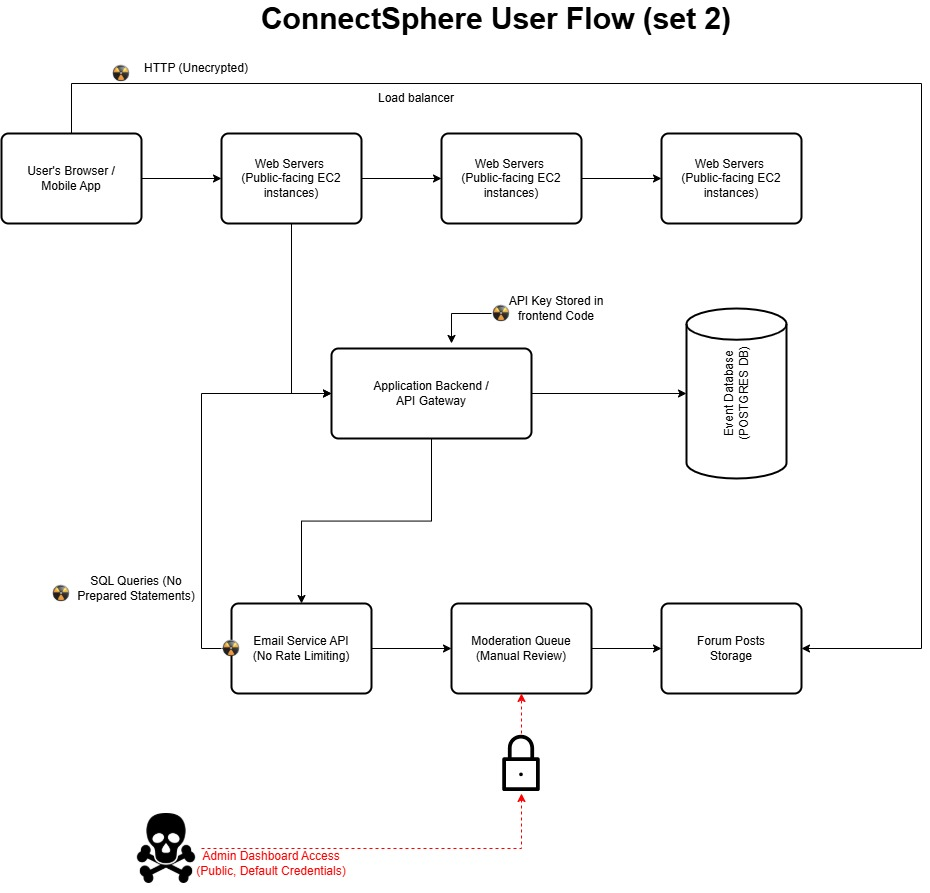

# Capstone Assessment: Prioritized Risk Analysis for "ConnectSphere"

**Module:** Cybersecurity Fundamentals for Modern Tech Roles
**Estimated time:** 60–90 minutes
**Submission:** Via the Moodle assignment activity (file upload + online text)

---

> ## 📰 The Brief Just Landed
>
> ConnectSphere's founders just walked out of a term sheet meeting. Two investors are ready to write checks for their Series A — **contingent on passing a security due-diligence review in fourteen days**. The CTO has no in-house security hire yet. She's brought you in, on retainer, as an **Independent Cybersecurity Governance Consultant**, to assess the platform's design and processes before the investors' own auditors do. Whatever you flag now, you fix before someone else finds it for you.

Welcome to ConnectSphere, a rapidly growing professional networking startup. Your role is to assess ConnectSphere's system design and processes for governance, risk, compliance, and security integrity.

## Objectives

- **Identify Security Risks** — Detect and classify risks in the ConnectSphere platform related to data protection, access control, and system design.
- **Apply Cybersecurity Principles** — Reference and apply core cybersecurity frameworks such as the CIA Triad, Principle of Least Privilege, and Secure SDLC practices.
- **Ensure Compliance** — Assess how the system aligns with international privacy and security standards (e.g., GDPR, CCPA).
- **Recommend Actionable Fixes** — Provide practical, role-specific mitigations and governance improvements.

## Scenario: The Flawed ConnectSphere Architecture

ConnectSphere's MVP (Minimum Viable Product) allows users to create professional profiles, register for events, and communicate via an in-app messaging system. However, an internal audit has flagged potential cybersecurity weaknesses in the system's architecture diagram.

**Preliminary concerns from the internal security review:**

- Sensitive data (PII) is transmitted over unencrypted channels.
- API endpoints may be overly permissive, exposing user data.
- The system lacks input validation, leaving it open to injection attacks.
- Access control roles are not well-defined, risking privilege escalation.
- No incident response or logging mechanisms are in place.

**Your task:** review the project brief and architecture diagram for your assigned set (see [Set 1](#set-1-project-brief) and [Set 2](#set-2-project-brief) below), identify the most critical risks, and propose governance-aligned mitigations.

---

## Required Deliverables

### Deliverable 1: Cybersecurity Governance Review Card

Complete the table below with **three distinct risk findings and one monitoring recommendation**. Each finding must reference a core cybersecurity principle (e.g., CIA Triad, PoLP, Input Validation).

| Section | Issue / Definition | Impact | Suggested Fix / Mitigation |
| --- | --- | --- | --- |
| **1. Confidentiality Risk** | | | |
| **2. Integrity Risk** | | | |
| **3. Availability Risk** | | | |
| **4. Monitoring / Reporting Recommendation** | Metric to Monitor (name & definition) | Visualization Type (e.g., Line, Bar, Heatmap) | Why It Matters (one sentence) |

### Deliverable 2: Corrected Architecture Diagram

Using your assigned ConnectSphere User Flow Diagram, **annotate at least three corrections**. Each annotation must briefly explain what change was made and why.

Key flaws to identify and correct:

- Missing encryption (HTTPS / TLS)
- Weak or missing access control on APIs
- No input validation or sanitization
- No secure session management
- No audit logging or incident response

> ✏️ **Example correction annotation**
>
> *"Implement HTTPS encryption for all data transmission — protects user PII and ensures data-in-transit confidentiality."*

### Deliverable 3: Summary of Review Process (200–300 words)

Write a short summary explaining your review process. Address:

- How you applied cybersecurity governance principles (CIA Triad, PoLP, SSDLC).
- How your findings improve ConnectSphere's compliance and data protection posture.
- Why your recommended monitoring metric supports ethical and transparent cybersecurity governance.

---

## Set 1: Project Brief

| Field | Detail |
| --- | --- |
| **Project Name** | ConnectSphere – Professional Event Networking MVP |
| **Target Audience** | Professional event organizers, conference attendees, industry association members |
| **Core Functionality** | User profiles, event registration, and secure messaging |
| **Business Goal** | Rapid market entry with emphasis on speed and scale |
| **Key Data Handled** | PII (name, email, phone, company, title), event registration data |
| **Unique Proposition** | Streamlined, distraction-free professional networking |

### Architecture Diagram: ConnectSphere User Flow (Set 1)

---

## Set 2: Project Brief

| Field | Detail |
| --- | --- |
| **Project Name** | ConnectSphere – Professional Connection Platform V1 |
| **Target Audience** | Mid-level professionals seeking industry-specific networking opportunities |
| **Core Functionality** | Profiles (name, employer, title, skills, LinkedIn URL), discovery and RSVP for virtual workshops, moderated event discussion forums; a "contact request" feature is planned |
| **Business Goal** | Establish a reliable platform for knowledge sharing and professional development; prioritize user experience and consistent availability for events; rapid iteration post-launch |
| **Key Data Handled** | User profile data (including sensitive professional details), event attendance records, forum post content |
| **Unique Selling Proposition** | A curated and secure environment for focused professional interaction, free from spam or irrelevant content |

### Architecture Diagram: ConnectSphere User Flow (Set 2)

*(This diagram has different specific flaws compared to Set 1.)*

---

## Submission Checklist

- [ ] Deliverable 1 — Governance Review Card completed (3 findings + 1 monitoring recommendation)
- [ ] Deliverable 2 — Annotated architecture diagram with at least 3 explained corrections
- [ ] Deliverable 3 — 200–300 word summary of your review process
- [ ] All findings reference a core principle (CIA Triad, PoLP, SSDLC, input validation, etc.)
