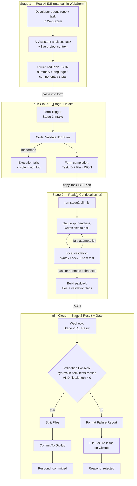

# Architecture

## Diagram

A Mermaid diagram is used instead of a static PNG — it renders natively on GitHub, stays accurate
as the workflow changes (no risk of a stale screenshot), and is a real, inspectable diagram rather
than an image I'd have to fabricate. If your submission platform needs a flat image, export this
block from a Mermaid live editor or GitHub's own render.

## Requirement mapping

Per the lab brief (`task/Multi-Stage AI Workflow.md`), the lab needs an AI-enabled IDE and an AI CLI
as two of its "AI UX types," chained so one's output feeds the other, with n8n available as
optional orchestration glue (the brief doesn't mandate n8n; it was this project's own choice).

| Lab requirement | Definition used here | Where it lives |
|---|---|---|
| AI-enabled IDE | An AI assistant embedded in a code editor, aware of the open project, used interactively | WebStorm + AI Assistant, Stage 1 (manual) |
| AI CLI | A non-interactive, scriptable AI agent invoked as a subprocess | Claude Code CLI via `claude -p`, Stage 2 (`scripts/run-stage2-cli.mjs`) |
| Multi-stage workflow | Output of stage N is structured input to stage N+1 | Plan JSON (IDE → n8n → CLI script) and result JSON (CLI script → n8n → GitHub) |
| n8n orchestration | Coordinates data hand-off between stages, enforces rules | Two triggers + validation Code node + IF gate + GitHub nodes |

## Gap analysis (redo audit, performed before any implementation change)

| Reviewer Requirement | Current (v1) Implementation | Status | Required Change | Resolved in v2? |
|---|---|---|---|---|
| Real AI IDE | `chainLlm` node, "IDE-based coding assistant" persona | FAIL | Replace with an actual IDE AI UX session, evidenced separately | Yes — WebStorm + AI Assistant is the real Stage 1; n8n only ingests its output |
| Real AI CLI | `chainLlm` node, "CLI-focused code generator" persona | FAIL | Replace with an actual AI CLI binary invocation | Yes — `claude -p` headless, invoked by `scripts/run-stage2-cli.mjs`, real subprocess |
| Multi-stage flow | Form → LLM → LLM → split → commit | PARTIAL | Keep structure, fix substance of stages 1–2 | Yes — same shape, real stages |
| Automated orchestration | n8n handles intake + commit | PASS | Keep n8n as orchestrator, not as the AI UX itself | Yes — n8n now only validates/gates/commits |
| Validation | None | FAIL | Add syntax/test check before commit | Yes — local syntax+test check, plus n8n's independent IF re-check |
| Error handling | None | FAIL | Add branch + failure path | Yes — IF node + `File Failure Issue` branch |
| Retry | None | FAIL | Add retry or justify its absence | Partially — local script retries generation (exercised for real, see run-log); n8n itself does not re-trigger Stage 2 (documented limitation, not silently missing) |
| Efficiency measurement | None | FAIL | Real measured timing | Partially — Stage 2 CLI+validation timing is real and measured; manual baseline is an explained estimate; n8n-side timing needs your own execution log (pending) |
| Documentation | Workflow JSON + video only | FAIL | README, architecture, run log, efficiency doc | Yes — this folder |
| Architecture diagram | ASCII in a sticky note | FAIL | Real diagram file | Yes — Mermaid diagram above |
| Run log | None | FAIL | Reproducible log from a real run | Partially — one real Stage 2 mechanism run logged; full Stage1→GitHub run is pending your manual steps (see README) |
| Generated output evidence | None saved | FAIL | Save a generated sample | Yes — `generated-output/sample-project/` (8 real files, real tests passing) |

## Alternatives considered and rejected

- **Renaming nodes / changing personas only** — explicitly what the reviewer flagged; rejected outright.
- **Automating the IDE stage via a headless editor/extension API** — no such API exists for
  JetBrains AI Assistant, GitHub Copilot, or Cursor as of this writing; would require reverse-
  engineering an unsupported internal protocol, which is neither credible nor stable. Rejected in
  favor of an honest manual step with evidence.
- **Running the AI CLI inside n8n via an Execute Command node** — not available/reliable on n8n
  Cloud's hosted plan (no arbitrary local binary execution, no persistent installed CLI tools in the
  execution sandbox). Would work on self-hosted n8n, but this instance is Cloud (confirmed with the
  user). Rejected for this instance; documented as the self-hosted alternative if the instance ever
  migrates.
- **Single combined "IDE+CLI" LLM call with two prompts in sequence** — this is exactly the rejected
  v1 design; a second persona prompt does not create a second UX type.
